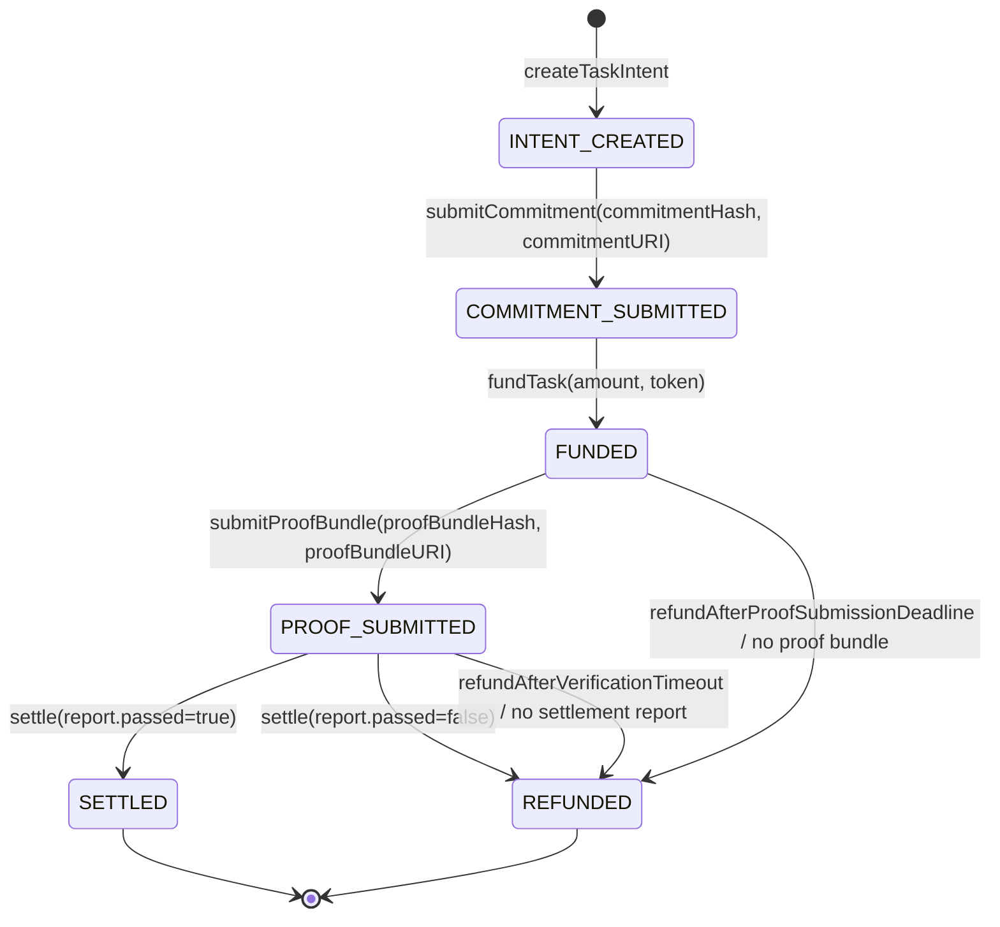

# FulFilPay Reference Files

This file aggregates all key reference files for the FulFilPay project.
Auto-generated for SDK implementation context.

# File: packages/contracts/artifacts/contracts/FulfillPaySettlement.sol/FulfillPaySettlement.json (abi field only)

```json
[
  {
    "inputs": [
      {
        "internalType": "address",
        "name": "verifierRegistry_",
        "type": "address"
      },
      {
        "internalType": "uint256",
        "name": "proofSubmissionGracePeriodMs_",
        "type": "uint256"
      },
      {
        "internalType": "uint256",
        "name": "verificationTimeoutMs_",
        "type": "uint256"
      }
    ],
    "stateMutability": "nonpayable",
    "type": "constructor"
  },
  {
    "inputs": [],
    "name": "EmptyHash",
    "type": "error"
  },
  {
    "inputs": [],
    "name": "EmptyReportHash",
    "type": "error"
  },
  {
    "inputs": [],
    "name": "EmptyURI",
    "type": "error"
  },
  {
    "inputs": [],
    "name": "InvalidConfig",
    "type": "error"
  },
  {
    "inputs": [],
    "name": "InvalidReportBinding",
    "type": "error"
  },
  {
    "inputs": [],
    "name": "InvalidSettlementAction",
    "type": "error"
  },
  {
    "inputs": [],
    "name": "InvalidSettlementAmount",
    "type": "error"
  },
  {
    "inputs": [],
    "name": "InvalidShortString",
    "type": "error"
  },
  {
    "inputs": [],
    "name": "InvalidTaskState",
    "type": "error"
  },
  {
    "inputs": [],
    "name": "OnlyBuyer",
    "type": "error"
  },
  {
    "inputs": [],
    "name": "OnlySeller",
    "type": "error"
  },
  {
    "inputs": [],
    "name": "ProofBundleAlreadyUsed",
    "type": "error"
  },
  {
    "inputs": [],
    "name": "ProofSubmissionWindowClosed",
    "type": "error"
  },
  {
    "inputs": [],
    "name": "ReportExpired",
    "type": "error"
  },
  {
    "inputs": [
      {
        "internalType": "string",
        "name": "str",
        "type": "string"
      }
    ],
    "name": "StringTooLong",
    "type": "error"
  },
  {
    "inputs": [],
    "name": "TaskExpired",
    "type": "error"
  },
  {
    "inputs": [],
    "name": "TaskNotFound",
    "type": "error"
  },
  {
    "inputs": [],
    "name": "TimeoutNotReached",
    "type": "error"
  },
  {
    "inputs": [],
    "name": "TokenNotAllowed",
    "type": "error"
  },
  {
    "inputs": [],
    "name": "UnauthorizedVerifier",
    "type": "error"
  },
  {
    "inputs": [],
    "name": "ZeroAddress",
    "type": "error"
  },
  {
    "inputs": [],
    "name": "ZeroAmount",
    "type": "error"
  },
  {
    "anonymous": false,
    "inputs": [
      {
        "indexed": true,
        "internalType": "bytes32",
        "name": "taskId",
        "type": "bytes32"
      },
      {
        "indexed": true,
        "internalType": "bytes32",
        "name": "commitmentHash",
        "type": "bytes32"
      },
      {
        "indexed": false,
        "internalType": "string",
        "name": "commitmentURI",
        "type": "string"
      }
    ],
    "name": "CommitmentSubmitted",
    "type": "event"
  },
  {
    "anonymous": false,
    "inputs": [],
    "name": "EIP712DomainChanged",
    "type": "event"
  },
  {
    "anonymous": false,
    "inputs": [
      {
        "indexed": true,
        "internalType": "address",
        "name": "previousOwner",
        "type": "address"
      },
      {
        "indexed": true,
        "internalType": "address",
        "name": "newOwner",
        "type": "address"
      }
    ],
    "name": "OwnershipTransferred",
    "type": "event"
  },
  {
    "anonymous": false,
    "inputs": [
      {
        "indexed": true,
        "internalType": "bytes32",
        "name": "taskId",
        "type": "bytes32"
      },
      {
        "indexed": true,
        "internalType": "bytes32",
        "name": "proofBundleHash",
        "type": "bytes32"
      },
      {
        "indexed": false,
        "internalType": "string",
        "name": "proofBundleURI",
        "type": "string"
      }
    ],
    "name": "ProofBundleSubmitted",
    "type": "event"
  },
  {
    "anonymous": false,
    "inputs": [
      {
        "indexed": true,
        "internalType": "bytes32",
        "name": "taskId",
        "type": "bytes32"
      },
      {
        "indexed": false,
        "internalType": "uint256",
        "name": "fundedAtMs",
        "type": "uint256"
      }
    ],
    "name": "TaskFunded",
    "type": "event"
  },
  {
    "anonymous": false,
    "inputs": [
      {
        "indexed": true,
        "internalType": "bytes32",
        "name": "taskId",
        "type": "bytes32"
      },
      {
        "indexed": true,
        "internalType": "bytes32",
        "name": "taskNonce",
        "type": "bytes32"
      },
      {
        "indexed": true,
        "internalType": "address",
        "name": "buyer",
        "type": "address"
      },
      {
        "indexed": false,
        "internalType": "address",
        "name": "seller",
        "type": "address"
      },
      {
        "indexed": false,
        "internalType": "address",
        "name": "token",
        "type": "address"
      },
      {
        "indexed": false,
        "internalType": "uint256",
        "name": "amount",
        "type": "uint256"
      },
      {
        "indexed": false,
        "internalType": "uint256",
        "name": "deadlineMs",
        "type": "uint256"
      },
      {
        "indexed": false,
        "internalType": "bytes32",
        "name": "metadataHash",
        "type": "bytes32"
      },
      {
        "indexed": false,
        "internalType": "string",
        "name": "metadataURI",
        "type": "string"
      }
    ],
    "name": "TaskIntentCreated",
    "type": "event"
  },
  {
    "anonymous": false,
    "inputs": [
      {
        "indexed": true,
        "internalType": "bytes32",
        "name": "taskId",
        "type": "bytes32"
      },
      {
        "indexed": true,
        "internalType": "bytes32",
        "name": "proofBundleHash",
        "type": "bytes32"
      },
      {
        "indexed": false,
        "internalType": "bytes32",
        "name": "reportHash",
        "type": "bytes32"
      },
      {
        "indexed": false,
        "internalType": "address",
        "name": "verifier",
        "type": "address"
      },
      {
        "indexed": false,
        "internalType": "uint256",
        "name": "refundedAtMs",
        "type": "uint256"
      }
    ],
    "name": "TaskRefunded",
    "type": "event"
  },
  {
    "anonymous": false,
    "inputs": [
      {
        "indexed": true,
        "internalType": "bytes32",
        "name": "taskId",
        "type": "bytes32"
      },
      {
        "indexed": true,
        "internalType": "bytes32",
        "name": "proofBundleHash",
        "type": "bytes32"
      },
      {
        "indexed": false,
        "internalType": "bytes32",
        "name": "reportHash",
        "type": "bytes32"
      },
      {
        "indexed": false,
        "internalType": "address",
        "name": "verifier",
        "type": "address"
      },
      {
        "indexed": false,
        "internalType": "uint256",
        "name": "settledAtMs",
        "type": "uint256"
      }
    ],
    "name": "TaskSettled",
    "type": "event"
  },
  {
    "anonymous": false,
    "inputs": [
      {
        "indexed": true,
        "internalType": "address",
        "name": "token",
        "type": "address"
      },
      {
        "indexed": false,
        "internalType": "bool",
        "name": "allowed",
        "type": "bool"
      }
    ],
    "name": "TokenAllowed",
    "type": "event"
  },
  {
    "inputs": [],
    "name": "EIP712_NAME",
    "outputs": [
      {
        "internalType": "string",
        "name": "",
        "type": "string"
      }
    ],
    "stateMutability": "view",
    "type": "function"
  },
  {
    "inputs": [],
    "name": "EIP712_VERSION",
    "outputs": [
      {
        "internalType": "string",
        "name": "",
        "type": "string"
      }
    ],
    "stateMutability": "view",
    "type": "function"
  },
  {
    "inputs": [],
    "name": "SETTLEMENT_ACTION_REFUND",
    "outputs": [
      {
        "internalType": "uint8",
        "name": "",
        "type": "uint8"
      }
    ],
    "stateMutability": "view",
    "type": "function"
  },
  {
    "inputs": [],
    "name": "SETTLEMENT_ACTION_RELEASE",
    "outputs": [
      {
        "internalType": "uint8",
        "name": "",
        "type": "uint8"
      }
    ],
    "stateMutability": "view",
    "type": "function"
  },
  {
    "inputs": [],
    "name": "VERIFICATION_REPORT_TYPEHASH",
    "outputs": [
      {
        "internalType": "bytes32",
        "name": "",
        "type": "bytes32"
      }
    ],
    "stateMutability": "view",
    "type": "function"
  },
  {
    "inputs": [
      {
        "internalType": "address",
        "name": "token",
        "type": "address"
      }
    ],
    "name": "allowedTokens",
    "outputs": [
      {
        "internalType": "bool",
        "name": "allowed",
        "type": "bool"
      }
    ],
    "stateMutability": "view",
    "type": "function"
  },
  {
    "inputs": [
      {
        "internalType": "address",
        "name": "seller",
        "type": "address"
      },
      {
        "internalType": "address",
        "name": "token",
        "type": "address"
      },
      {
        "internalType": "uint256",
        "name": "amount",
        "type": "uint256"
      },
      {
        "internalType": "uint256",
        "name": "deadlineMs",
        "type": "uint256"
      },
      {
        "internalType": "bytes32",
        "name": "metadataHash",
        "type": "bytes32"
      },
      {
        "internalType": "string",
        "name": "metadataURI",
        "type": "string"
      }
    ],
    "name": "createTaskIntent",
    "outputs": [
      {
        "internalType": "bytes32",
        "name": "taskId",
        "type": "bytes32"
      },
      {
        "internalType": "bytes32",
        "name": "taskNonce",
        "type": "bytes32"
      }
    ],
    "stateMutability": "nonpayable",
    "type": "function"
  },
  {
    "inputs": [],
    "name": "currentTimeMs",
    "outputs": [
      {
        "internalType": "uint256",
        "name": "",
        "type": "uint256"
      }
    ],
    "stateMutability": "view",
    "type": "function"
  },
  {
    "inputs": [],
    "name": "domainSeparatorV4",
    "outputs": [
      {
        "internalType": "bytes32",
        "name": "",
        "type": "bytes32"
      }
    ],
    "stateMutability": "view",
    "type": "function"
  },
  {
    "inputs": [],
    "name": "eip712Domain",
    "outputs": [
      {
        "internalType": "bytes1",
        "name": "fields",
        "type": "bytes1"
      },
      {
        "internalType": "string",
        "name": "name",
        "type": "string"
      },
      {
        "internalType": "string",
        "name": "version",
        "type": "string"
      },
      {
        "internalType": "uint256",
        "name": "chainId",
        "type": "uint256"
      },
      {
        "internalType": "address",
        "name": "verifyingContract",
        "type": "address"
      },
      {
        "internalType": "bytes32",
        "name": "salt",
        "type": "bytes32"
      },
      {
        "internalType": "uint256[]",
        "name": "extensions",
        "type": "uint256[]"
      }
    ],
    "stateMutability": "view",
    "type": "function"
  },
  {
    "inputs": [
      {
        "internalType": "bytes32",
        "name": "taskId",
        "type": "bytes32"
      }
    ],
    "name": "fundTask",
    "outputs": [],
    "stateMutability": "nonpayable",
    "type": "function"
  },
  {
    "inputs": [
      {
        "internalType": "bytes32",
        "name": "taskId",
        "type": "bytes32"
      }
    ],
    "name": "getTask",
    "outputs": [
      {
        "components": [
          {
            "internalType": "bytes32",
            "name": "taskId",
            "type": "bytes32"
          },
          {
            "internalType": "bytes32",
            "name": "taskNonce",
            "type": "bytes32"
          },
          {
            "internalType": "address",
            "name": "buyer",
            "type": "address"
          },
          {
            "internalType": "address",
            "name": "seller",
            "type": "address"
          },
          {
            "internalType": "address",
            "name": "token",
            "type": "address"
          },
          {
            "internalType": "uint256",
            "name": "amount",
            "type": "uint256"
          },
          {
            "internalType": "uint256",
            "name": "deadlineMs",
            "type": "uint256"
          },
          {
            "internalType": "bytes32",
            "name": "commitmentHash",
            "type": "bytes32"
          },
          {
            "internalType": "string",
            "name": "commitmentURI",
            "type": "string"
          },
          {
            "internalType": "uint256",
            "name": "fundedAtMs",
            "type": "uint256"
          },
          {
            "internalType": "bytes32",
            "name": "proofBundleHash",
            "type": "bytes32"
          },
          {
            "internalType": "string",
            "name": "proofBundleURI",
            "type": "string"
          },
          {
            "internalType": "uint256",
            "name": "proofSubmittedAtMs",
            "type": "uint256"
          },
          {
            "internalType": "bytes32",
            "name": "reportHash",
            "type": "bytes32"
          },
          {
            "internalType": "uint256",
            "name": "settledAtMs",
            "type": "uint256"
          },
          {
            "internalType": "uint256",
            "name": "refundedAtMs",
            "type": "uint256"
          },
          {
            "internalType": "enum FulfillPaySettlement.TaskStatus",
            "name": "status",
            "type": "uint8"
          }
        ],
        "internalType": "struct FulfillPaySettlement.Task",
        "name": "",
        "type": "tuple"
      }
    ],
    "stateMutability": "view",
    "type": "function"
  },
  {
    "inputs": [
      {
        "components": [
          {
            "internalType": "bytes32",
            "name": "taskId",
            "type": "bytes32"
          },
          {
            "internalType": "address",
            "name": "buyer",
            "type": "address"
          },
          {
            "internalType": "address",
            "name": "seller",
            "type": "address"
          },
          {
            "internalType": "bytes32",
            "name": "commitmentHash",
            "type": "bytes32"
          },
          {
            "internalType": "bytes32",
            "name": "proofBundleHash",
            "type": "bytes32"
          },
          {
            "internalType": "bool",
            "name": "passed",
            "type": "bool"
          },
          {
            "internalType": "uint8",
            "name": "settlementAction",
            "type": "uint8"
          },
          {
            "internalType": "uint256",
            "name": "settlementAmount",
            "type": "uint256"
          },
          {
            "internalType": "uint256",
            "name": "verifiedAt",
            "type": "uint256"
          },
          {
            "internalType": "bytes32",
            "name": "reportHash",
            "type": "bytes32"
          }
        ],
        "internalType": "struct FulfillPaySettlement.VerificationReport",
        "name": "report",
        "type": "tuple"
      }
    ],
    "name": "hashTypedVerificationReport",
    "outputs": [
      {
        "internalType": "bytes32",
        "name": "",
        "type": "bytes32"
      }
    ],
    "stateMutability": "view",
    "type": "function"
  },
  {
    "inputs": [
      {
        "components": [
          {
            "internalType": "bytes32",
            "name": "taskId",
            "type": "bytes32"
          },
          {
            "internalType": "address",
            "name": "buyer",
            "type": "address"
          },
          {
            "internalType": "address",
            "name": "seller",
            "type": "address"
          },
          {
            "internalType": "bytes32",
            "name": "commitmentHash",
            "type": "bytes32"
          },
          {
            "internalType": "bytes32",
            "name": "proofBundleHash",
            "type": "bytes32"
          },
          {
            "internalType": "bool",
            "name": "passed",
            "type": "bool"
          },
          {
            "internalType": "uint8",
            "name": "settlementAction",
            "type": "uint8"
          },
          {
            "internalType": "uint256",
            "name": "settlementAmount",
            "type": "uint256"
          },
          {
            "internalType": "uint256",
            "name": "verifiedAt",
            "type": "uint256"
          },
          {
            "internalType": "bytes32",
            "name": "reportHash",
            "type": "bytes32"
          }
        ],
        "internalType": "struct FulfillPaySettlement.VerificationReport",
        "name": "report",
        "type": "tuple"
      }
    ],
    "name": "hashVerificationReport",
    "outputs": [
      {
        "internalType": "bytes32",
        "name": "",
        "type": "bytes32"
      }
    ],
    "stateMutability": "pure",
    "type": "function"
  },
  {
    "inputs": [],
    "name": "nextSequence",
    "outputs": [
      {
        "internalType": "uint256",
        "name": "",
        "type": "uint256"
      }
    ],
    "stateMutability": "view",
    "type": "function"
  },
  {
    "inputs": [],
    "name": "owner",
    "outputs": [
      {
        "internalType": "address",
        "name": "",
        "type": "address"
      }
    ],
    "stateMutability": "view",
    "type": "function"
  },
  {
    "inputs": [],
    "name": "proofSubmissionGracePeriodMs",
    "outputs": [
      {
        "internalType": "uint256",
        "name": "",
        "type": "uint256"
      }
    ],
    "stateMutability": "view",
    "type": "function"
  },
  {
    "inputs": [
      {
        "internalType": "bytes32",
        "name": "taskId",
        "type": "bytes32"
      }
    ],
    "name": "refundAfterProofSubmissionDeadline",
    "outputs": [],
    "stateMutability": "nonpayable",
    "type": "function"
  },
  {
    "inputs": [
      {
        "internalType": "bytes32",
        "name": "taskId",
        "type": "bytes32"
      }
    ],
    "name": "refundAfterVerificationTimeout",
    "outputs": [],
    "stateMutability": "nonpayable",
    "type": "function"
  },
  {
    "inputs": [],
    "name": "renounceOwnership",
    "outputs": [],
    "stateMutability": "nonpayable",
    "type": "function"
  },
  {
    "inputs": [
      {
        "internalType": "address",
        "name": "token",
        "type": "address"
      },
      {
        "internalType": "bool",
        "name": "allowed",
        "type": "bool"
      }
    ],
    "name": "setAllowedToken",
    "outputs": [],
    "stateMutability": "nonpayable",
    "type": "function"
  },
  {
    "inputs": [
      {
        "components": [
          {
            "internalType": "bytes32",
            "name": "taskId",
            "type": "bytes32"
          },
          {
            "internalType": "address",
            "name": "buyer",
            "type": "address"
          },
          {
            "internalType": "address",
            "name": "seller",
            "type": "address"
          },
          {
            "internalType": "bytes32",
            "name": "commitmentHash",
            "type": "bytes32"
          },
          {
            "internalType": "bytes32",
            "name": "proofBundleHash",
            "type": "bytes32"
          },
          {
            "internalType": "bool",
            "name": "passed",
            "type": "bool"
          },
          {
            "internalType": "uint8",
            "name": "settlementAction",
            "type": "uint8"
          },
          {
            "internalType": "uint256",
            "name": "settlementAmount",
            "type": "uint256"
          },
          {
            "internalType": "uint256",
            "name": "verifiedAt",
            "type": "uint256"
          },
          {
            "internalType": "bytes32",
            "name": "reportHash",
            "type": "bytes32"
          }
        ],
        "internalType": "struct FulfillPaySettlement.VerificationReport",
        "name": "report",
        "type": "tuple"
      },
      {
        "internalType": "bytes",
        "name": "signature",
        "type": "bytes"
      }
    ],
    "name": "settle",
    "outputs": [],
    "stateMutability": "nonpayable",
    "type": "function"
  },
  {
    "inputs": [
      {
        "internalType": "bytes32",
        "name": "taskId",
        "type": "bytes32"
      },
      {
        "internalType": "bytes32",
        "name": "commitmentHash",
        "type": "bytes32"
      },
      {
        "internalType": "string",
        "name": "commitmentURI",
        "type": "string"
      }
    ],
    "name": "submitCommitment",
    "outputs": [],
    "stateMutability": "nonpayable",
    "type": "function"
  },
  {
    "inputs": [
      {
        "internalType": "bytes32",
        "name": "taskId",
        "type": "bytes32"
      },
      {
        "internalType": "bytes32",
        "name": "proofBundleHash",
        "type": "bytes32"
      },
      {
        "internalType": "string",
        "name": "proofBundleURI",
        "type": "string"
      }
    ],
    "name": "submitProofBundle",
    "outputs": [],
    "stateMutability": "nonpayable",
    "type": "function"
  },
  {
    "inputs": [
      {
        "internalType": "address",
        "name": "newOwner",
        "type": "address"
      }
    ],
    "name": "transferOwnership",
    "outputs": [],
    "stateMutability": "nonpayable",
    "type": "function"
  },
  {
    "inputs": [
      {
        "internalType": "bytes32",
        "name": "proofBundleHash",
        "type": "bytes32"
      }
    ],
    "name": "usedProofBundleHash",
    "outputs": [
      {
        "internalType": "bool",
        "name": "used",
        "type": "bool"
      }
    ],
    "stateMutability": "view",
    "type": "function"
  },
  {
    "inputs": [],
    "name": "verificationTimeoutMs",
    "outputs": [
      {
        "internalType": "uint256",
        "name": "",
        "type": "uint256"
      }
    ],
    "stateMutability": "view",
    "type": "function"
  },
  {
    "inputs": [],
    "name": "verifierRegistry",
    "outputs": [
      {
        "internalType": "contract IVerifierRegistry",
        "name": "",
        "type": "address"
      }
    ],
    "stateMutability": "view",
    "type": "function"
  }
]
```

---
# File: packages/contracts/contracts/FulfillPaySettlement.sol

// SPDX-License-Identifier: MIT
pragma solidity ^0.8.24;

import {EIP712} from "@openzeppelin/contracts/utils/cryptography/EIP712.sol";
import {ECDSA} from "@openzeppelin/contracts/utils/cryptography/ECDSA.sol";
import {IERC20} from "@openzeppelin/contracts/token/ERC20/IERC20.sol";
import {SafeERC20} from "@openzeppelin/contracts/token/ERC20/utils/SafeERC20.sol";
import {Ownable} from "@openzeppelin/contracts/access/Ownable.sol";

interface IVerifierRegistry {
    function isVerifier(address verifier) external view returns (bool);
}

contract FulfillPaySettlement is EIP712, Ownable {
    using SafeERC20 for IERC20;

    string public constant EIP712_NAME = "FulfillPay";
    string public constant EIP712_VERSION = "1";

    uint8 public constant SETTLEMENT_ACTION_RELEASE = 1;
    uint8 public constant SETTLEMENT_ACTION_REFUND = 2;

    bytes32 public constant VERIFICATION_REPORT_TYPEHASH =
        keccak256(
            "VerificationReport(bytes32 taskId,address buyer,address seller,bytes32 commitmentHash,bytes32 proofBundleHash,bool passed,uint8 settlementAction,uint256 settlementAmount,uint256 verifiedAt,bytes32 reportHash)"
        );

    enum TaskStatus {
        INTENT_CREATED,
        COMMITMENT_SUBMITTED,
        FUNDED,
        PROOF_SUBMITTED,
        SETTLED,
        REFUNDED
    }

    struct Task {
        bytes32 taskId;
        bytes32 taskNonce;
        address buyer;
        address seller;
        address token;
        uint256 amount;
        uint256 deadlineMs;
        bytes32 commitmentHash;
        string commitmentURI;
        uint256 fundedAtMs;
        bytes32 proofBundleHash;
        string proofBundleURI;
        uint256 proofSubmittedAtMs;
        bytes32 reportHash;
        uint256 settledAtMs;
        uint256 refundedAtMs;
        TaskStatus status;
    }

    struct VerificationReport {
        bytes32 taskId;
        address buyer;
        address seller;
        bytes32 commitmentHash;
        bytes32 proofBundleHash;
        bool passed;
        uint8 settlementAction;
        uint256 settlementAmount;
        uint256 verifiedAt;
        bytes32 reportHash;
    }

    IVerifierRegistry public immutable verifierRegistry;
    uint256 public immutable proofSubmissionGracePeriodMs;
    uint256 public immutable verificationTimeoutMs;

    uint256 public nextSequence = 1;

    mapping(bytes32 taskId => Task task) private tasks;
    mapping(bytes32 proofBundleHash => bool used) public usedProofBundleHash;
    mapping(address token => bool allowed) public allowedTokens;

    event TaskIntentCreated(
        bytes32 indexed taskId,
        bytes32 indexed taskNonce,
        address indexed buyer,
        address seller,
        address token,
        uint256 amount,
        uint256 deadlineMs,
        bytes32 metadataHash,
        string metadataURI
    );
    event CommitmentSubmitted(bytes32 indexed taskId, bytes32 indexed commitmentHash, string commitmentURI);
    event TaskFunded(bytes32 indexed taskId, uint256 fundedAtMs);
    event ProofBundleSubmitted(bytes32 indexed taskId, bytes32 indexed proofBundleHash, string proofBundleURI);
    event TaskSettled(
        bytes32 indexed taskId,
        bytes32 indexed proofBundleHash,
        bytes32 reportHash,
        address verifier,
        uint256 settledAtMs
    );
    event TaskRefunded(
        bytes32 indexed taskId,
        bytes32 indexed proofBundleHash,
        bytes32 reportHash,
        address verifier,
        uint256 refundedAtMs
    );
    event TokenAllowed(address indexed token, bool allowed);

    error EmptyHash();
    error EmptyReportHash();
    error EmptyURI();
    error InvalidConfig();
    error InvalidReportBinding();
    error InvalidSettlementAction();
    error InvalidSettlementAmount();
    error InvalidTaskState();
    error OnlyBuyer();
    error OnlySeller();
    error ProofBundleAlreadyUsed();
    error ProofSubmissionWindowClosed();
    error ReportExpired();
    error TimeoutNotReached();
    error TaskExpired();
    error TaskNotFound();
    error TokenNotAllowed();
    error UnauthorizedVerifier();
    error ZeroAddress();
    error ZeroAmount();

    constructor(address verifierRegistry_, uint256 proofSubmissionGracePeriodMs_, uint256 verificationTimeoutMs_)
        EIP712(EIP712_NAME, EIP712_VERSION)
    {
        if (verifierRegistry_ == address(0)) {
            revert ZeroAddress();
        }
        if (proofSubmissionGracePeriodMs_ == 0 || verificationTimeoutMs_ == 0) {
            revert InvalidConfig();
        }

        verifierRegistry = IVerifierRegistry(verifierRegistry_);
        proofSubmissionGracePeriodMs = proofSubmissionGracePeriodMs_;
        verificationTimeoutMs = verificationTimeoutMs_;
    }

    function setAllowedToken(address token, bool allowed) external onlyOwner {
        if (token == address(0)) {
            revert ZeroAddress();
        }

        allowedTokens[token] = allowed;
        emit TokenAllowed(token, allowed);
    }

    function createTaskIntent(
        address seller,
        address token,
        uint256 amount,
        uint256 deadlineMs,
        bytes32 metadataHash,
        string calldata metadataURI
    ) external returns (bytes32 taskId, bytes32 taskNonce) {
        if (seller == address(0) || token == address(0)) {
            revert ZeroAddress();
        }
        if (!allowedTokens[token]) {
            revert TokenNotAllowed();
        }
        if (amount == 0) {
            revert ZeroAmount();
        }
        if (deadlineMs <= _currentTimeMs()) {
            revert TaskExpired();
        }

        uint256 sequence = nextSequence++;
        taskId = keccak256(abi.encode(address(this), block.chainid, msg.sender, sequence));
        taskNonce = keccak256(abi.encode(taskId, msg.sender, seller));

        Task storage task = tasks[taskId];
        task.taskId = taskId;
        task.taskNonce = taskNonce;
        task.buyer = msg.sender;
        task.seller = seller;
        task.token = token;
        task.amount = amount;
        task.deadlineMs = deadlineMs;
        task.status = TaskStatus.INTENT_CREATED;

        emit TaskIntentCreated(taskId, taskNonce, msg.sender, seller, token, amount, deadlineMs, metadataHash, metadataURI);
    }

    function submitCommitment(bytes32 taskId, bytes32 commitmentHash, string calldata commitmentURI) external {
        Task storage task = _getExistingTask(taskId);
        if (task.status != TaskStatus.INTENT_CREATED) {
            revert InvalidTaskState();
        }
        if (msg.sender != task.seller) {
            revert OnlySeller();
        }
        if (commitmentHash == bytes32(0)) {
            revert EmptyHash();
        }
        if (bytes(commitmentURI).length == 0) {
            revert EmptyURI();
        }
        if (task.deadlineMs <= _currentTimeMs()) {
            revert TaskExpired();
        }

        task.commitmentHash = commitmentHash;
        task.commitmentURI = commitmentURI;
        task.status = TaskStatus.COMMITMENT_SUBMITTED;

        emit CommitmentSubmitted(taskId, commitmentHash, commitmentURI);
    }

    function fundTask(bytes32 taskId) external {
        Task storage task = _getExistingTask(taskId);
        if (task.status != TaskStatus.COMMITMENT_SUBMITTED) {
            revert InvalidTaskState();
        }
        if (msg.sender != task.buyer) {
            revert OnlyBuyer();
        }
        if (!allowedTokens[task.token]) {
            revert TokenNotAllowed();
        }

        uint256 nowMs = _currentTimeMs();
        if (nowMs > task.deadlineMs) {
            revert TaskExpired();
        }

        IERC20(task.token).safeTransferFrom(msg.sender, address(this), task.amount);

        task.fundedAtMs = nowMs;
        task.status = TaskStatus.FUNDED;

        emit TaskFunded(taskId, task.fundedAtMs);
    }

    function submitProofBundle(bytes32 taskId, bytes32 proofBundleHash, string calldata proofBundleURI) external {
        Task storage task = _getExistingTask(taskId);
        if (task.status != TaskStatus.FUNDED) {
            revert InvalidTaskState();
        }
        if (msg.sender != task.seller) {
            revert OnlySeller();
        }
        if (proofBundleHash == bytes32(0)) {
            revert EmptyHash();
        }
        if (bytes(proofBundleURI).length == 0) {
            revert EmptyURI();
        }
        if (_currentTimeMs() > task.deadlineMs + proofSubmissionGracePeriodMs) {
            revert ProofSubmissionWindowClosed();
        }

        task.proofBundleHash = proofBundleHash;
        task.proofBundleURI = proofBundleURI;
        task.proofSubmittedAtMs = _currentTimeMs();
        task.status = TaskStatus.PROOF_SUBMITTED;

        emit ProofBundleSubmitted(taskId, proofBundleHash, proofBundleURI);
    }

    function settle(VerificationReport calldata report, bytes calldata signature) external {
        Task storage task = _getExistingTask(report.taskId);
        if (task.status != TaskStatus.PROOF_SUBMITTED) {
            revert InvalidTaskState();
        }
        if (report.reportHash == bytes32(0)) {
            revert EmptyReportHash();
        }
        if (usedProofBundleHash[report.proofBundleHash]) {
            revert ProofBundleAlreadyUsed();
        }
        if (
            report.taskId != task.taskId || report.buyer != task.buyer || report.seller != task.seller
                || report.commitmentHash != task.commitmentHash || report.proofBundleHash != task.proofBundleHash
        ) {
            revert InvalidReportBinding();
        }
        if (report.settlementAmount != task.amount) {
            revert InvalidSettlementAmount();
        }
        if (report.verifiedAt > task.proofSubmittedAtMs + verificationTimeoutMs) {
            revert ReportExpired();
        }
        if (
            (report.passed && report.settlementAction != SETTLEMENT_ACTION_RELEASE)
                || (!report.passed && report.settlementAction != SETTLEMENT_ACTION_REFUND)
        ) {
            revert InvalidSettlementAction();
        }

        address recoveredVerifier = ECDSA.recover(_hashTypedDataV4(_hashVerificationReport(report)), signature);
        if (!verifierRegistry.isVerifier(recoveredVerifier)) {
            revert UnauthorizedVerifier();
        }

        usedProofBundleHash[report.proofBundleHash] = true;
        task.reportHash = report.reportHash;

        if (report.passed) {
            task.status = TaskStatus.SETTLED;
            task.settledAtMs = _currentTimeMs();
            IERC20(task.token).safeTransfer(task.seller, task.amount);
            emit TaskSettled(task.taskId, task.proofBundleHash, report.reportHash, recoveredVerifier, task.settledAtMs);
        } else {
            task.status = TaskStatus.REFUNDED;
            task.refundedAtMs = _currentTimeMs();
            IERC20(task.token).safeTransfer(task.buyer, task.amount);
            emit TaskRefunded(task.taskId, task.proofBundleHash, report.reportHash, recoveredVerifier, task.refundedAtMs);
        }
    }

    function refundAfterProofSubmissionDeadline(bytes32 taskId) external {
        Task storage task = _getExistingTask(taskId);
        if (task.status != TaskStatus.FUNDED) {
            revert InvalidTaskState();
        }
        if (_currentTimeMs() <= task.deadlineMs + proofSubmissionGracePeriodMs) {
            revert TimeoutNotReached();
        }

        task.status = TaskStatus.REFUNDED;
        task.refundedAtMs = _currentTimeMs();
        IERC20(task.token).safeTransfer(task.buyer, task.amount);

        emit TaskRefunded(task.taskId, bytes32(0), bytes32(0), address(0), task.refundedAtMs);
    }

    function refundAfterVerificationTimeout(bytes32 taskId) external {
        Task storage task = _getExistingTask(taskId);
        if (task.status != TaskStatus.PROOF_SUBMITTED) {
            revert InvalidTaskState();
        }
        if (_currentTimeMs() <= task.proofSubmittedAtMs + verificationTimeoutMs) {
            revert TimeoutNotReached();
        }

        task.status = TaskStatus.REFUNDED;
        task.refundedAtMs = _currentTimeMs();
        IERC20(task.token).safeTransfer(task.buyer, task.amount);

        emit TaskRefunded(task.taskId, task.proofBundleHash, bytes32(0), address(0), task.refundedAtMs);
    }

    function getTask(bytes32 taskId) external view returns (Task memory) {
        return _getExistingTask(taskId);
    }

    function domainSeparatorV4() external view returns (bytes32) {
        return _domainSeparatorV4();
    }

    function hashVerificationReport(VerificationReport calldata report) external pure returns (bytes32) {
        return _hashVerificationReport(report);
    }

    function hashTypedVerificationReport(VerificationReport calldata report) external view returns (bytes32) {
        return _hashTypedDataV4(_hashVerificationReport(report));
    }

    function currentTimeMs() external view returns (uint256) {
        return _currentTimeMs();
    }

    function _hashVerificationReport(VerificationReport calldata report) internal pure returns (bytes32) {
        return keccak256(
            abi.encode(
                VERIFICATION_REPORT_TYPEHASH,
                report.taskId,
                report.buyer,
                report.seller,
                report.commitmentHash,
                report.proofBundleHash,
                report.passed,
                report.settlementAction,
                report.settlementAmount,
                report.verifiedAt,
                report.reportHash
            )
        );
    }

    function _getExistingTask(bytes32 taskId) internal view returns (Task storage task) {
        task = tasks[taskId];
        if (task.buyer == address(0)) {
            revert TaskNotFound();
        }
    }

    function _currentTimeMs() internal view returns (uint256) {
        return block.timestamp * 1000;
    }
}


---
# File: packages/contracts/test/fulfillpay-settlement.test.ts

import { readFileSync } from "node:fs";
import path from "node:path";

import { loadFixture, time } from "@nomicfoundation/hardhat-toolbox/network-helpers";
import { expect } from "chai";
import { ethers } from "hardhat";

import {
  FulfillPaySettlement,
  FulfillPaySettlement__factory,
  MockERC20,
  MockERC20__factory,
  VerifierRegistry,
  VerifierRegistry__factory
} from "../typechain-types";

type VectorFile = {
  domain: {
    name: string;
    version: string;
    chainId: string;
    verifyingContract: string;
  };
  message: {
    taskId: string;
    buyer: string;
    seller: string;
    commitmentHash: string;
    proofBundleHash: string;
    passed: boolean;
    settlementAction: number;
    settlementAmount: string;
    verifiedAt: string;
    reportHash: string;
  };
  typeHashes: {
    domainSeparator: string;
    digest: string;
    structHash: string;
  };
};

type HashVectorFile = {
  hashes: {
    commitmentHash: string;
    proofBundleHash: string;
    verificationReportHash: string;
  };
};

function loadJson<T>(relativePath: string): T {
  const absolutePath = path.join(__dirname, "..", "..", "..", "test", relativePath);
  return JSON.parse(readFileSync(absolutePath, "utf8")) as T;
}

type DeployFixtureResult = Awaited<ReturnType<typeof deployFixture>>;

async function addressOf(contract: Parameters<typeof ethers.resolveAddress>[0]): Promise<string> {
  return ethers.resolveAddress(contract);
}

async function deployFixture() {
  const [owner, buyer, seller, verifier, outsider] = await ethers.getSigners();

  const verifierRegistryFactory = new VerifierRegistry__factory(owner);
  const verifierRegistry = (await verifierRegistryFactory.deploy(owner.address)) as VerifierRegistry;
  await verifierRegistry.waitForDeployment();
  await verifierRegistry.addVerifier(verifier.address);

  const gracePeriodMs = 15n * 60n * 1000n;
  const verificationTimeoutMs = 60n * 60n * 1000n;
  const verifierRegistryAddress = await addressOf(verifierRegistry);

  const settlementFactory = new FulfillPaySettlement__factory(owner);
  const settlement = (await settlementFactory.deploy(
    verifierRegistryAddress,
    gracePeriodMs,
    verificationTimeoutMs
  )) as FulfillPaySettlement;
  await settlement.waitForDeployment();

  const mockTokenFactory = new MockERC20__factory(owner);
  const mockToken = (await mockTokenFactory.deploy("FulfillPay Mock USD", "fpUSD", owner.address, 0)) as MockERC20;
  await mockToken.waitForDeployment();
  const settlementAddress = await addressOf(settlement);
  await settlement.setAllowedToken(await addressOf(mockToken), true);

  await mockToken.mint(buyer.address, 10_000_000n);
  await mockToken.connect(buyer).approve(settlementAddress, 10_000_000n);

  return {
    owner,
    buyer,
    seller,
    verifier,
    outsider,
    verifierRegistry,
    settlement,
    mockToken,
    gracePeriodMs,
    verificationTimeoutMs
  };
}

async function createFundedTaskOnFixture(
  fixture: DeployFixtureResult,
  options: {
    commitmentHash?: string;
  } = {}
) {
  const current = await time.latest();
  const deadlineMs = BigInt(current + 3600) * 1000n;
  const metadataHash = ethers.ZeroHash;
  const metadataUri = "ipfs://fulfillpay/task/basic";
  const tokenAddress = await addressOf(fixture.mockToken);
  const args = [
    fixture.seller.address,
    tokenAddress,
    1_000_000n,
    deadlineMs,
    metadataHash,
    metadataUri
  ] as const;

  const [taskId] = await fixture.settlement.connect(fixture.buyer).createTaskIntent.staticCall(...args);
  const createTx = await fixture.settlement.connect(fixture.buyer).createTaskIntent(...args);
  await createTx.wait();
  const commitmentHash = options.commitmentHash ?? ethers.keccak256(ethers.toUtf8Bytes("commitment/basic"));

  await fixture.settlement
    .connect(fixture.seller)
    .submitCommitment(taskId, commitmentHash, "ipfs://fulfillpay/commitments/basic");
  await fixture.settlement.connect(fixture.buyer).fundTask(taskId);

  return {
    ...fixture,
    taskId,
    deadlineMs,
    commitmentHash
  };
}

async function createFundedTask(options: { commitmentHash?: string } = {}) {
  const fixture = await loadFixture(deployFixture);
  return createFundedTaskOnFixture(fixture, options);
}

async function createProofSubmittedTask(
  options: {
    fixture?: DeployFixtureResult;
    commitmentHash?: string;
    proofBundleHash?: string;
  } = {}
) {
  const fixture = options.fixture ?? (await loadFixture(deployFixture));
  const fundedTask = await createFundedTaskOnFixture(fixture, {
    commitmentHash: options.commitmentHash
  });
  const bundleHash = options.proofBundleHash ?? ethers.keccak256(ethers.toUtf8Bytes("proof-bundle/basic"));

  await fundedTask.settlement
    .connect(fundedTask.seller)
    .submitProofBundle(fundedTask.taskId, bundleHash, "ipfs://fulfillpay/proof-bundles/basic");

  return {
    ...fundedTask,
    proofBundleHash: bundleHash
  };
}

async function signReport(
  verifier: Awaited<ReturnType<typeof deployFixture>>["verifier"],
  settlementAddress: string,
  chainId: bigint,
  report: {
    taskId: string;
    buyer: string;
    seller: string;
    commitmentHash: string;
    proofBundleHash: string;
    passed: boolean;
    settlementAction: number;
    settlementAmount: bigint;
    verifiedAt: bigint;
    reportHash: string;
  }
) {
  return verifier.signTypedData(
    {
      name: "FulfillPay",
      version: "1",
      chainId,
      verifyingContract: settlementAddress
    },
    {
      VerificationReport: [
        { name: "taskId", type: "bytes32" },
        { name: "buyer", type: "address" },
        { name: "seller", type: "address" },
        { name: "commitmentHash", type: "bytes32" },
        { name: "proofBundleHash", type: "bytes32" },
        { name: "passed", type: "bool" },
        { name: "settlementAction", type: "uint8" },
        { name: "settlementAmount", type: "uint256" },
        { name: "verifiedAt", type: "uint256" },
        { name: "reportHash", type: "bytes32" }
      ]
    },
    report
  );
}

describe("FulfillPaySettlement", function () {
  it("matches the EIP-712 vector and contract hashing helpers", async function () {
    const vector = loadJson<VectorFile>(path.join("vectors", "eip712", "verification-report-pass-basic.json"));
    const hashVector = loadJson<HashVectorFile>(path.join("vectors", "hashing", "pass-basic.json"));
    const fixture = await loadFixture(deployFixture);

    const types: Record<string, Array<{ name: string; type: string }>> = {
      VerificationReport: [
        { name: "taskId", type: "bytes32" },
        { name: "buyer", type: "address" },
        { name: "seller", type: "address" },
        { name: "commitmentHash", type: "bytes32" },
        { name: "proofBundleHash", type: "bytes32" },
        { name: "passed", type: "bool" },
        { name: "settlementAction", type: "uint8" },
        { name: "settlementAmount", type: "uint256" },
        { name: "verifiedAt", type: "uint256" },
        { name: "reportHash", type: "bytes32" }
      ]
    };

    const vectorStructHash = ethers.TypedDataEncoder.hashStruct("VerificationReport", types, {
      ...vector.message,
      settlementAmount: BigInt(vector.message.settlementAmount),
      verifiedAt: BigInt(vector.message.verifiedAt)
    });
    const vectorDigest = ethers.TypedDataEncoder.hash(
      vector.domain,
      types,
      {
        ...vector.message,
        settlementAmount: BigInt(vector.message.settlementAmount),
        verifiedAt: BigInt(vector.message.verifiedAt)
      }
    );

    expect(vectorStructHash).to.equal(vector.typeHashes.structHash);
    expect(vectorDigest).to.equal(vector.typeHashes.digest);
    expect(hashVector.hashes.commitmentHash).to.equal(vector.message.commitmentHash);
    expect(hashVector.hashes.proofBundleHash).to.equal(vector.message.proofBundleHash);

    const actualSettlementAddress = await addressOf(fixture.settlement);
    const actualChainId = (await ethers.provider.getNetwork()).chainId;
    const report = {
      ...vector.message,
      settlementAmount: BigInt(vector.message.settlementAmount),
      verifiedAt: BigInt(vector.message.verifiedAt)
    };
    const contractStructHash = await fixture.settlement.hashVerificationReport(report);
    const contractDigest = await fixture.settlement.hashTypedVerificationReport(report);
    const ethersDigest = ethers.TypedDataEncoder.hash(
      {
        name: "FulfillPay",
        version: "1",
        chainId: actualChainId,
        verifyingContract: actualSettlementAddress
      },
      types,
      report
    );

    expect(contractStructHash).to.equal(vector.typeHashes.structHash);
    expect(contractDigest).to.equal(ethersDigest);
  });

  it("settles a passing task and releases escrow to the seller", async function () {
    const task = await createProofSubmittedTask();
    const chainId = (await ethers.provider.getNetwork()).chainId;
    const settlementAddress = await addressOf(task.settlement);
    const verifiedAt = BigInt(await task.settlement.currentTimeMs());
    const report = {
      taskId: task.taskId,
      buyer: task.buyer.address,
      seller: task.seller.address,
      commitmentHash: task.commitmentHash,
      proofBundleHash: task.proofBundleHash,
      passed: true,
      settlementAction: 1,
      settlementAmount: 1_000_000n,
      verifiedAt,
      reportHash: ethers.keccak256(ethers.toUtf8Bytes("report/pass"))
    };
    const signature = await signReport(task.verifier, settlementAddress, chainId, report);

    await expect(task.settlement.settle(report, signature)).to.emit(task.settlement, "TaskSettled");

    const storedTask = await task.settlement.getTask(task.taskId);
    expect(storedTask.status).to.equal(4n);
    expect(await task.mockToken.balanceOf(task.seller.address)).to.equal(1_000_000n);
    expect(await task.mockToken.balanceOf(await addressOf(task.settlement))).to.equal(0n);
    expect(await task.settlement.usedProofBundleHash(task.proofBundleHash)).to.equal(true);
  });

  it("refunds a failing report and stores the fixture hashes cleanly", async function () {
    const hashVector = loadJson<HashVectorFile>(path.join("vectors", "hashing", "pass-basic.json"));
    const task = await createProofSubmittedTask({
      commitmentHash: hashVector.hashes.commitmentHash,
      proofBundleHash: hashVector.hashes.proofBundleHash
    });

    const chainId = (await ethers.provider.getNetwork()).chainId;
    const report = {
      taskId: task.taskId,
      buyer: task.buyer.address,
      seller: task.seller.address,
      commitmentHash: hashVector.hashes.commitmentHash,
      proofBundleHash: hashVector.hashes.proofBundleHash,
      passed: false,
      settlementAction: 2,
      settlementAmount: 1_000_000n,
      verifiedAt: BigInt(await task.settlement.currentTimeMs()),
      reportHash: hashVector.hashes.verificationReportHash
    };
    const signature = await signReport(task.verifier, await addressOf(task.settlement), chainId, report);

    await expect(task.settlement.settle(report, signature)).to.emit(task.settlement, "TaskRefunded");

    const storedTask = await task.settlement.getTask(task.taskId);
    expect(storedTask.commitmentHash).to.equal(hashVector.hashes.commitmentHash);
    expect(storedTask.proofBundleHash).to.equal(hashVector.hashes.proofBundleHash);
    expect(storedTask.reportHash).to.equal(hashVector.hashes.verificationReportHash);
    expect(storedTask.status).to.equal(5n);
    expect(await task.mockToken.balanceOf(task.buyer.address)).to.equal(10_000_000n);
  });

  it("rejects commitment submission by a non-seller", async function () {
    const fixture = await loadFixture(deployFixture);
    const current = await time.latest();
    const deadlineMs = BigInt(current + 3600) * 1000n;
    const args = [
      fixture.seller.address,
      await addressOf(fixture.mockToken),
      1_000_000n,
      deadlineMs,
      ethers.ZeroHash,
      ""
    ] as const;
    const [taskId] = await fixture.settlement.connect(fixture.buyer).createTaskIntent.staticCall(...args);
    await fixture.settlement.connect(fixture.buyer).createTaskIntent(...args);

    await expect(
      fixture.settlement
        .connect(fixture.outsider)
        .submitCommitment(taskId, ethers.keccak256(ethers.toUtf8Bytes("bad")), "ipfs://bad")
    ).to.be.revertedWithCustomError(fixture.settlement, "OnlySeller");
  });

  it("rejects proof submission before funding and settlement before proof", async function () {
    const fixture = await loadFixture(deployFixture);
    const current = await time.latest();
    const deadlineMs = BigInt(current + 3600) * 1000n;
    const args = [
      fixture.seller.address,
      await addressOf(fixture.mockToken),
      1_000_000n,
      deadlineMs,
      ethers.ZeroHash,
      ""
    ] as const;
    const [taskId] = await fixture.settlement.connect(fixture.buyer).createTaskIntent.staticCall(...args);
    await fixture.settlement.connect(fixture.buyer).createTaskIntent(...args);

    await fixture.settlement
      .connect(fixture.seller)
      .submitCommitment(taskId, ethers.keccak256(ethers.toUtf8Bytes("commitment")), "ipfs://commitment");

    await expect(
      fixture.settlement
        .connect(fixture.seller)
        .submitProofBundle(taskId, ethers.keccak256(ethers.toUtf8Bytes("bundle")), "ipfs://bundle")
    ).to.be.revertedWithCustomError(fixture.settlement, "InvalidTaskState");

    const report = {
      taskId,
      buyer: fixture.buyer.address,
      seller: fixture.seller.address,
      commitmentHash: ethers.keccak256(ethers.toUtf8Bytes("commitment")),
      proofBundleHash: ethers.keccak256(ethers.toUtf8Bytes("bundle")),
      passed: true,
      settlementAction: 1,
      settlementAmount: 1_000_000n,
      verifiedAt: BigInt(await fixture.settlement.currentTimeMs()),
      reportHash: ethers.keccak256(ethers.toUtf8Bytes("report"))
    };
    const signature = await signReport(
      fixture.verifier,
      await addressOf(fixture.settlement),
      (await ethers.provider.getNetwork()).chainId,
      report
    );

    await expect(
      fixture.settlement.settle(report, signature)
    ).to.be.revertedWithCustomError(fixture.settlement, "InvalidTaskState");
  });

  it("rejects an unauthorized verifier signature and keeps the task pending", async function () {
    const task = await createProofSubmittedTask();
    const chainId = (await ethers.provider.getNetwork()).chainId;
    const report = {
      taskId: task.taskId,
      buyer: task.buyer.address,
      seller: task.seller.address,
      commitmentHash: task.commitmentHash,
      proofBundleHash: task.proofBundleHash,
      passed: false,
      settlementAction: 2,
      settlementAmount: 1_000_000n,
      verifiedAt: BigInt(await task.settlement.currentTimeMs()),
      reportHash: ethers.keccak256(ethers.toUtf8Bytes("report/unauthorized"))
    };
    const signature = await signReport(task.outsider, await addressOf(task.settlement), chainId, report);

    await expect(
      task.settlement.settle(report, signature)
    ).to.be.revertedWithCustomError(task.settlement, "UnauthorizedVerifier");

    const storedTask = await task.settlement.getTask(task.taskId);
    expect(storedTask.status).to.equal(3n);
  });

  it("rejects proof bundle replay across tasks", async function () {
    const fixture = await loadFixture(deployFixture);
    const sharedProofBundleHash = ethers.keccak256(ethers.toUtf8Bytes("bundle/replayed"));
    const firstTask = await createProofSubmittedTask({
      fixture,
      proofBundleHash: sharedProofBundleHash
    });
    const reportOne = {
      taskId: firstTask.taskId,
      buyer: firstTask.buyer.address,
      seller: firstTask.seller.address,
      commitmentHash: firstTask.commitmentHash,
      proofBundleHash: sharedProofBundleHash,
      passed: true,
      settlementAction: 1,
      settlementAmount: 1_000_000n,
      verifiedAt: BigInt(await firstTask.settlement.currentTimeMs()),
      reportHash: ethers.keccak256(ethers.toUtf8Bytes("report/one"))
    };
    const chainId = (await ethers.provider.getNetwork()).chainId;
    const signatureOne = await signReport(
      firstTask.verifier,
      await addressOf(firstTask.settlement),
      chainId,
      reportOne
    );
    await firstTask.settlement.settle(reportOne, signatureOne);

    const secondTask = await createFundedTaskOnFixture(fixture);
    await secondTask.settlement
      .connect(secondTask.seller)
      .submitProofBundle(secondTask.taskId, sharedProofBundleHash, "ipfs://fulfillpay/proof-bundles/replay");

    const reportTwo = {
      taskId: secondTask.taskId,
      buyer: secondTask.buyer.address,
      seller: secondTask.seller.address,
      commitmentHash: secondTask.commitmentHash,
      proofBundleHash: sharedProofBundleHash,
      passed: false,
      settlementAction: 2,
      settlementAmount: 1_000_000n,
      verifiedAt: BigInt(await secondTask.settlement.currentTimeMs()),
      reportHash: ethers.keccak256(ethers.toUtf8Bytes("report/two"))
    };
    const signatureTwo = await signReport(
      secondTask.verifier,
      await addressOf(secondTask.settlement),
      chainId,
      reportTwo
    );

    await expect(
      secondTask.settlement.settle(reportTwo, signatureTwo)
    ).to.be.revertedWithCustomError(secondTask.settlement, "ProofBundleAlreadyUsed");
  });

  it("refunds after proof submission timeout expires", async function () {
    const task = await createFundedTask();

    await time.increaseTo(Number((task.deadlineMs + task.gracePeriodMs) / 1000n) + 1);

    await expect(task.settlement.refundAfterProofSubmissionDeadline(task.taskId)).to.emit(
      task.settlement,
      "TaskRefunded"
    );

    const storedTask = await task.settlement.getTask(task.taskId);
    expect(storedTask.status).to.equal(5n);
    expect(await task.mockToken.balanceOf(task.buyer.address)).to.equal(10_000_000n);
  });

  it("rejects proof submission after the grace period closes", async function () {
    const task = await createFundedTask();

    await time.increaseTo(Number((task.deadlineMs + task.gracePeriodMs) / 1000n) + 1);

    await expect(
      task.settlement
        .connect(task.seller)
        .submitProofBundle(task.taskId, ethers.keccak256(ethers.toUtf8Bytes("bundle/late")), "ipfs://late")
    ).to.be.revertedWithCustomError(task.settlement, "ProofSubmissionWindowClosed");
  });

  it("refunds after verification timeout expires", async function () {
    const task = await createProofSubmittedTask();

    const storedTask = await task.settlement.getTask(task.taskId);
    await time.increaseTo(Number((storedTask.proofSubmittedAtMs + task.verificationTimeoutMs) / 1000n) + 1);

    await expect(task.settlement.refundAfterVerificationTimeout(task.taskId)).to.emit(
      task.settlement,
      "TaskRefunded"
    );

    const updatedTask = await task.settlement.getTask(task.taskId);
    expect(updatedTask.status).to.equal(5n);
    expect(await task.mockToken.balanceOf(task.buyer.address)).to.equal(10_000_000n);
  });
});


---
# File: test/vectors/eip712/verification-report-pass-basic.json

{
  "name": "verification-report-pass-basic",
  "scenario": "EIP-712 digest for the unsigned passing verification report in the basic Phase 1 task.",
  "domain": {
    "name": "FulfillPay",
    "version": "1",
    "chainId": "31337",
    "verifyingContract": "0x4444444444444444444444444444444444444444"
  },
  "domainType": "EIP712Domain(string name,string version,uint256 chainId,address verifyingContract)",
  "reportType": "VerificationReport(bytes32 taskId,address buyer,address seller,bytes32 commitmentHash,bytes32 proofBundleHash,bool passed,uint8 settlementAction,uint256 settlementAmount,uint256 verifiedAt,bytes32 reportHash)",
  "message": {
    "taskId": "0x5555555555555555555555555555555555555555555555555555555555555555",
    "buyer": "0x1111111111111111111111111111111111111111",
    "seller": "0x2222222222222222222222222222222222222222",
    "commitmentHash": "0x6ca31a2e5bc526c2172ca32f128213d9b1e3bd699b0eee446e7d3172357f528a",
    "proofBundleHash": "0xcb24838e336e57d8398dc543b2fa406471f724b26321ab4f3cce4814891de3d7",
    "passed": true,
    "settlementAction": 1,
    "settlementAmount": "1000000",
    "verifiedAt": "1735686900000",
    "reportHash": "0xc651276636791738328a0ce58cc3f52ef786f1ef1814144ea8a6857e31f0e715"
  },
  "typeHashes": {
    "nameHash": "0xe2c49266b3e4e9e046bed8bc623397e17a74c1a49d1e0037a065a7f8510a3c80",
    "versionHash": "0xc89efdaa54c0f20c7adf612882df0950f5a951637e0307cdcb4c672f298b8bc6",
    "domainSeparator": "0x24b3aa9c4fe0856f88593c669f4845c91c217001e4dd664a60975b6d9342f55b",
    "structHash": "0xd319f365b0afdf45f929b60581a6dc69ab72e5be9d79bc1e0e32e565f038d34f",
    "digest": "0x689219a247fb2fda3c61a7f570712a2ec00ae94ea5cf24b8bfaa09e6d8ca3bdb"
  },
  "fixture": "test/fixtures/protocol/verification-reports/verification-report.pass-basic.unsigned.json"
}


---
# File: test/vectors/hashing/pass-basic.json

{
  "name": "pass-basic",
  "scenario": "Single-call passing task with one mock receipt and full release settlement.",
  "hashes": {
    "taskIntentHash": "0x3cabd998e069ab6b94aadf54065f52f4822d1f0b74b53b18003ec0bdc03a6990",
    "taskContextHash": "0x1385f097d4a29a5e8268c6da90fc09848c035b8199f1b32d41c3a38f2d374207",
    "commitmentHash": "0x6ca31a2e5bc526c2172ca32f128213d9b1e3bd699b0eee446e7d3172357f528a",
    "callIntentHash": "0xddd7776ef8be07ac441076aefa5eb46859a31129311dbad6b8b72f864775d76b",
    "receiptHash": "0xf819ac0b3dd7fb8e6a0921bbd3aa213c2a9861c1c3ecbcd8d6bbf5254e8774e3",
    "proofBundleHash": "0xcb24838e336e57d8398dc543b2fa406471f724b26321ab4f3cce4814891de3d7",
    "verificationReportHash": "0xc651276636791738328a0ce58cc3f52ef786f1ef1814144ea8a6857e31f0e715"
  },
  "fixtures": {
    "taskIntent": "test/fixtures/protocol/task-intents/task-intent.basic.json",
    "taskContext": "test/fixtures/protocol/task-contexts/task-context.basic.json",
    "commitment": "test/fixtures/protocol/commitments/commitment.openai-compatible.json",
    "callIntent": "test/fixtures/protocol/call-intents/call-intent.basic.json",
    "receipt": "test/fixtures/protocol/receipts/receipt.mock.valid.json",
    "proofBundle": "test/fixtures/protocol/proof-bundles/proof-bundle.pass-basic.json",
    "verificationReportUnsigned": "test/fixtures/protocol/verification-reports/verification-report.pass-basic.unsigned.json"
  }
}


---
# File: test/fixtures/protocol/task-intents/task-intent.basic.json

{
  "name": "task-intent.basic",
  "objectType": "TaskIntent",
  "object": {
    "schemaVersion": "fulfillpay.task-intent.v1",
    "buyer": "0x1111111111111111111111111111111111111111",
    "seller": "0x2222222222222222222222222222222222222222",
    "token": "0x3333333333333333333333333333333333333333",
    "amount": "1000000",
    "deadline": "1735689600000",
    "metadataHash": "0xaaaaaaaaaaaaaaaaaaaaaaaaaaaaaaaaaaaaaaaaaaaaaaaaaaaaaaaaaaaaaaaa",
    "metadataURI": "ipfs://fulfillpay/task-metadata/basic"
  },
  "canonical": "{\"amount\":\"1000000\",\"buyer\":\"0x1111111111111111111111111111111111111111\",\"deadline\":\"1735689600000\",\"metadataHash\":\"0xaaaaaaaaaaaaaaaaaaaaaaaaaaaaaaaaaaaaaaaaaaaaaaaaaaaaaaaaaaaaaaaa\",\"metadataURI\":\"ipfs://fulfillpay/task-metadata/basic\",\"schemaVersion\":\"fulfillpay.task-intent.v1\",\"seller\":\"0x2222222222222222222222222222222222222222\",\"token\":\"0x3333333333333333333333333333333333333333\"}",
  "hash": "0x3cabd998e069ab6b94aadf54065f52f4822d1f0b74b53b18003ec0bdc03a6990",
  "notes": "Minimal funded-task intent fixture for Phase 1 protocol vectors."
}


---
# File: test/fixtures/protocol/task-contexts/task-context.basic.json

{
  "name": "task-context.basic",
  "objectType": "TaskContext",
  "object": {
    "schemaVersion": "fulfillpay.task-context.v1",
    "protocol": "FulfillPay",
    "version": 1,
    "chainId": "31337",
    "settlementContract": "0x4444444444444444444444444444444444444444",
    "taskId": "0x5555555555555555555555555555555555555555555555555555555555555555",
    "taskNonce": "0x6666666666666666666666666666666666666666666666666666666666666666",
    "commitmentHash": "0x6ca31a2e5bc526c2172ca32f128213d9b1e3bd699b0eee446e7d3172357f528a",
    "buyer": "0x1111111111111111111111111111111111111111",
    "seller": "0x2222222222222222222222222222222222222222"
  },
  "canonical": "{\"buyer\":\"0x1111111111111111111111111111111111111111\",\"chainId\":\"31337\",\"commitmentHash\":\"0x6ca31a2e5bc526c2172ca32f128213d9b1e3bd699b0eee446e7d3172357f528a\",\"protocol\":\"FulfillPay\",\"schemaVersion\":\"fulfillpay.task-context.v1\",\"seller\":\"0x2222222222222222222222222222222222222222\",\"settlementContract\":\"0x4444444444444444444444444444444444444444\",\"taskId\":\"0x5555555555555555555555555555555555555555555555555555555555555555\",\"taskNonce\":\"0x6666666666666666666666666666666666666666666666666666666666666666\",\"version\":1}",
  "hash": "0x1385f097d4a29a5e8268c6da90fc09848c035b8199f1b32d41c3a38f2d374207",
  "notes": "Canonical task binding context reused by call intents and delivery receipts."
}


---
# File: test/fixtures/protocol/commitments/commitment.openai-compatible.json

{
  "name": "commitment.openai-compatible",
  "objectType": "ExecutionCommitment",
  "object": {
    "schemaVersion": "fulfillpay.execution-commitment.v1",
    "taskId": "0x5555555555555555555555555555555555555555555555555555555555555555",
    "buyer": "0x1111111111111111111111111111111111111111",
    "seller": "0x2222222222222222222222222222222222222222",
    "target": {
      "host": "api.openai.com",
      "path": "/v1/chat/completions",
      "method": "POST"
    },
    "allowedModels": [
      "gpt-4o-mini"
    ],
    "minUsage": {
      "totalTokens": 120
    },
    "deadline": "1735689600000",
    "verifier": "0x7777777777777777777777777777777777777777",
    "termsHash": "0xbbbbbbbbbbbbbbbbbbbbbbbbbbbbbbbbbbbbbbbbbbbbbbbbbbbbbbbbbbbbbbbb",
    "termsURI": "ipfs://fulfillpay/terms/basic"
  },
  "canonical": "{\"allowedModels\":[\"gpt-4o-mini\"],\"buyer\":\"0x1111111111111111111111111111111111111111\",\"deadline\":\"1735689600000\",\"minUsage\":{\"totalTokens\":120},\"schemaVersion\":\"fulfillpay.execution-commitment.v1\",\"seller\":\"0x2222222222222222222222222222222222222222\",\"target\":{\"host\":\"api.openai.com\",\"method\":\"POST\",\"path\":\"/v1/chat/completions\"},\"taskId\":\"0x5555555555555555555555555555555555555555555555555555555555555555\",\"termsHash\":\"0xbbbbbbbbbbbbbbbbbbbbbbbbbbbbbbbbbbbbbbbbbbbbbbbbbbbbbbbbbbbbbbbb\",\"termsURI\":\"ipfs://fulfillpay/terms/basic\",\"verifier\":\"0x7777777777777777777777777777777777777777\"}",
  "hash": "0x6ca31a2e5bc526c2172ca32f128213d9b1e3bd699b0eee446e7d3172357f528a",
  "notes": "Single-endpoint OpenAI-compatible commitment with one allowed model and a minimum token usage threshold."
}


---
# File: test/fixtures/protocol/call-intents/call-intent.basic.json

{
  "name": "call-intent.basic",
  "objectType": "CallIntent",
  "object": {
    "schemaVersion": "fulfillpay.call-intent.v1",
    "taskContextHash": "0x1385f097d4a29a5e8268c6da90fc09848c035b8199f1b32d41c3a38f2d374207",
    "callIndex": 0,
    "host": "api.openai.com",
    "path": "/v1/chat/completions",
    "method": "POST",
    "declaredModel": "gpt-4o-mini",
    "requestBodyHash": "0x8888888888888888888888888888888888888888888888888888888888888888"
  },
  "canonical": "{\"callIndex\":0,\"declaredModel\":\"gpt-4o-mini\",\"host\":\"api.openai.com\",\"method\":\"POST\",\"path\":\"/v1/chat/completions\",\"requestBodyHash\":\"0x8888888888888888888888888888888888888888888888888888888888888888\",\"schemaVersion\":\"fulfillpay.call-intent.v1\",\"taskContextHash\":\"0x1385f097d4a29a5e8268c6da90fc09848c035b8199f1b32d41c3a38f2d374207\"}",
  "hash": "0xddd7776ef8be07ac441076aefa5eb46859a31129311dbad6b8b72f864775d76b",
  "notes": "Normalized single-call intent derived from the shared task context."
}


---
# File: test/fixtures/protocol/receipts/receipt.mock.valid.json

{
  "name": "receipt.mock.valid",
  "objectType": "DeliveryReceipt",
  "object": {
    "schemaVersion": "fulfillpay.delivery-receipt.v1",
    "taskContext": {
      "schemaVersion": "fulfillpay.task-context.v1",
      "protocol": "FulfillPay",
      "version": 1,
      "chainId": "31337",
      "settlementContract": "0x4444444444444444444444444444444444444444",
      "taskId": "0x5555555555555555555555555555555555555555555555555555555555555555",
      "taskNonce": "0x6666666666666666666666666666666666666666666666666666666666666666",
      "commitmentHash": "0x6ca31a2e5bc526c2172ca32f128213d9b1e3bd699b0eee446e7d3172357f528a",
      "buyer": "0x1111111111111111111111111111111111111111",
      "seller": "0x2222222222222222222222222222222222222222"
    },
    "callIndex": 0,
    "callIntentHash": "0xddd7776ef8be07ac441076aefa5eb46859a31129311dbad6b8b72f864775d76b",
    "provider": "mock",
    "providerProofId": "mock-proof-0001",
    "requestHash": "0x9999999999999999999999999999999999999999999999999999999999999999",
    "responseHash": "0xaaaaaaaaaaaaaaaaaaaaaaaaaaaaaaaaaaaaaaaaaaaaaaaaaaaaaaaaaaaaaaaa",
    "observedAt": "1735686000000",
    "extracted": {
      "model": "gpt-4o-mini",
      "usage": {
        "totalTokens": 128
      }
    },
    "rawProofHash": "0xcccccccccccccccccccccccccccccccccccccccccccccccccccccccccccccccc",
    "rawProofURI": "ipfs://fulfillpay/raw-proof/mock-proof-0001"
  },
  "canonical": "{\"callIndex\":0,\"callIntentHash\":\"0xddd7776ef8be07ac441076aefa5eb46859a31129311dbad6b8b72f864775d76b\",\"extracted\":{\"model\":\"gpt-4o-mini\",\"usage\":{\"totalTokens\":128}},\"observedAt\":\"1735686000000\",\"provider\":\"mock\",\"providerProofId\":\"mock-proof-0001\",\"rawProofHash\":\"0xcccccccccccccccccccccccccccccccccccccccccccccccccccccccccccccccc\",\"rawProofURI\":\"ipfs://fulfillpay/raw-proof/mock-proof-0001\",\"requestHash\":\"0x9999999999999999999999999999999999999999999999999999999999999999\",\"responseHash\":\"0xaaaaaaaaaaaaaaaaaaaaaaaaaaaaaaaaaaaaaaaaaaaaaaaaaaaaaaaaaaaaaaaa\",\"schemaVersion\":\"fulfillpay.delivery-receipt.v1\",\"taskContext\":{\"buyer\":\"0x1111111111111111111111111111111111111111\",\"chainId\":\"31337\",\"commitmentHash\":\"0x6ca31a2e5bc526c2172ca32f128213d9b1e3bd699b0eee446e7d3172357f528a\",\"protocol\":\"FulfillPay\",\"schemaVersion\":\"fulfillpay.task-context.v1\",\"seller\":\"0x2222222222222222222222222222222222222222\",\"settlementContract\":\"0x4444444444444444444444444444444444444444\",\"taskId\":\"0x5555555555555555555555555555555555555555555555555555555555555555\",\"taskNonce\":\"0x6666666666666666666666666666666666666666666666666666666666666666\",\"version\":1}}",
  "hash": "0xf819ac0b3dd7fb8e6a0921bbd3aa213c2a9861c1c3ecbcd8d6bbf5254e8774e3",
  "notes": "Valid mock provider receipt bound to the same task context and satisfying the committed model."
}


---
# File: test/fixtures/protocol/proof-bundles/proof-bundle.pass-basic.json

{
  "name": "proof-bundle.pass-basic",
  "objectType": "ProofBundle",
  "object": {
    "schemaVersion": "fulfillpay.proof-bundle.v1",
    "taskId": "0x5555555555555555555555555555555555555555555555555555555555555555",
    "commitmentHash": "0x6ca31a2e5bc526c2172ca32f128213d9b1e3bd699b0eee446e7d3172357f528a",
    "seller": "0x2222222222222222222222222222222222222222",
    "receipts": [
      {
        "schemaVersion": "fulfillpay.delivery-receipt.v1",
        "taskContext": {
          "schemaVersion": "fulfillpay.task-context.v1",
          "protocol": "FulfillPay",
          "version": 1,
          "chainId": "31337",
          "settlementContract": "0x4444444444444444444444444444444444444444",
          "taskId": "0x5555555555555555555555555555555555555555555555555555555555555555",
          "taskNonce": "0x6666666666666666666666666666666666666666666666666666666666666666",
          "commitmentHash": "0x6ca31a2e5bc526c2172ca32f128213d9b1e3bd699b0eee446e7d3172357f528a",
          "buyer": "0x1111111111111111111111111111111111111111",
          "seller": "0x2222222222222222222222222222222222222222"
        },
        "callIndex": 0,
        "callIntentHash": "0xddd7776ef8be07ac441076aefa5eb46859a31129311dbad6b8b72f864775d76b",
        "provider": "mock",
        "providerProofId": "mock-proof-0001",
        "requestHash": "0x9999999999999999999999999999999999999999999999999999999999999999",
        "responseHash": "0xaaaaaaaaaaaaaaaaaaaaaaaaaaaaaaaaaaaaaaaaaaaaaaaaaaaaaaaaaaaaaaaa",
        "observedAt": "1735686000000",
        "extracted": {
          "model": "gpt-4o-mini",
          "usage": {
            "totalTokens": 128
          }
        },
        "rawProofHash": "0xcccccccccccccccccccccccccccccccccccccccccccccccccccccccccccccccc",
        "rawProofURI": "ipfs://fulfillpay/raw-proof/mock-proof-0001"
      }
    ],
    "aggregateUsage": {
      "totalTokens": 128
    },
    "createdAt": "1735686600000"
  },
  "canonical": "{\"aggregateUsage\":{\"totalTokens\":128},\"commitmentHash\":\"0x6ca31a2e5bc526c2172ca32f128213d9b1e3bd699b0eee446e7d3172357f528a\",\"createdAt\":\"1735686600000\",\"receipts\":[{\"callIndex\":0,\"callIntentHash\":\"0xddd7776ef8be07ac441076aefa5eb46859a31129311dbad6b8b72f864775d76b\",\"extracted\":{\"model\":\"gpt-4o-mini\",\"usage\":{\"totalTokens\":128}},\"observedAt\":\"1735686000000\",\"provider\":\"mock\",\"providerProofId\":\"mock-proof-0001\",\"rawProofHash\":\"0xcccccccccccccccccccccccccccccccccccccccccccccccccccccccccccccccc\",\"rawProofURI\":\"ipfs://fulfillpay/raw-proof/mock-proof-0001\",\"requestHash\":\"0x9999999999999999999999999999999999999999999999999999999999999999\",\"responseHash\":\"0xaaaaaaaaaaaaaaaaaaaaaaaaaaaaaaaaaaaaaaaaaaaaaaaaaaaaaaaaaaaaaaaa\",\"schemaVersion\":\"fulfillpay.delivery-receipt.v1\",\"taskContext\":{\"buyer\":\"0x1111111111111111111111111111111111111111\",\"chainId\":\"31337\",\"commitmentHash\":\"0x6ca31a2e5bc526c2172ca32f128213d9b1e3bd699b0eee446e7d3172357f528a\",\"protocol\":\"FulfillPay\",\"schemaVersion\":\"fulfillpay.task-context.v1\",\"seller\":\"0x2222222222222222222222222222222222222222\",\"settlementContract\":\"0x4444444444444444444444444444444444444444\",\"taskId\":\"0x5555555555555555555555555555555555555555555555555555555555555555\",\"taskNonce\":\"0x6666666666666666666666666666666666666666666666666666666666666666\",\"version\":1}}],\"schemaVersion\":\"fulfillpay.proof-bundle.v1\",\"seller\":\"0x2222222222222222222222222222222222222222\",\"taskId\":\"0x5555555555555555555555555555555555555555555555555555555555555555\"}",
  "hash": "0xcb24838e336e57d8398dc543b2fa406471f724b26321ab4f3cce4814891de3d7",
  "notes": "Minimal passing proof bundle with one valid receipt and aggregate usage above the threshold."
}


---
# File: test/fixtures/protocol/verification-reports/verification-report.pass-basic.unsigned.json

{
  "name": "verification-report.pass-basic.unsigned",
  "objectType": "VerificationReportUnsigned",
  "object": {
    "schemaVersion": "fulfillpay.verification-report.v1",
    "chainId": "31337",
    "settlementContract": "0x4444444444444444444444444444444444444444",
    "taskId": "0x5555555555555555555555555555555555555555555555555555555555555555",
    "buyer": "0x1111111111111111111111111111111111111111",
    "seller": "0x2222222222222222222222222222222222222222",
    "commitmentHash": "0x6ca31a2e5bc526c2172ca32f128213d9b1e3bd699b0eee446e7d3172357f528a",
    "proofBundleHash": "0xcb24838e336e57d8398dc543b2fa406471f724b26321ab4f3cce4814891de3d7",
    "passed": true,
    "checks": {
      "commitmentHashMatched": true,
      "endpointMatched": true,
      "modelMatched": true,
      "proofBundleHashMatched": true,
      "proofNotConsumed": true,
      "taskContextMatched": true,
      "usageSatisfied": true,
      "withinTaskWindow": true,
      "zkTlsProofValid": true
    },
    "aggregateUsage": {
      "totalTokens": 128
    },
    "settlement": {
      "action": "RELEASE",
      "amount": "1000000"
    },
    "verifier": "0x7777777777777777777777777777777777777777",
    "verifiedAt": "1735686900000"
  },
  "canonical": "{\"aggregateUsage\":{\"totalTokens\":128},\"buyer\":\"0x1111111111111111111111111111111111111111\",\"chainId\":\"31337\",\"checks\":{\"commitmentHashMatched\":true,\"endpointMatched\":true,\"modelMatched\":true,\"proofBundleHashMatched\":true,\"proofNotConsumed\":true,\"taskContextMatched\":true,\"usageSatisfied\":true,\"withinTaskWindow\":true,\"zkTlsProofValid\":true},\"commitmentHash\":\"0x6ca31a2e5bc526c2172ca32f128213d9b1e3bd699b0eee446e7d3172357f528a\",\"passed\":true,\"proofBundleHash\":\"0xcb24838e336e57d8398dc543b2fa406471f724b26321ab4f3cce4814891de3d7\",\"schemaVersion\":\"fulfillpay.verification-report.v1\",\"seller\":\"0x2222222222222222222222222222222222222222\",\"settlement\":{\"action\":\"RELEASE\",\"amount\":\"1000000\"},\"settlementContract\":\"0x4444444444444444444444444444444444444444\",\"taskId\":\"0x5555555555555555555555555555555555555555555555555555555555555555\",\"verifiedAt\":\"1735686900000\",\"verifier\":\"0x7777777777777777777777777777777777777777\"}",
  "hash": "0xc651276636791738328a0ce58cc3f52ef786f1ef1814144ea8a6857e31f0e715",
  "notes": "Unsigned report body used to derive the EIP-712 digest. Signature material lives in test/vectors/eip712."
}


---
# File: packages/sdk-core/src/types/index.ts

export type HexString = `0x${string}`;


---
# File: packages/sdk-core/src/hash/index.ts

export function hashObject(input: string): string {
  return input;
}


---
# File: packages/sdk-core/src/eip712/index.ts

export const verificationReportDomain = "FulfillPay";


---
# File: packages/sdk-core/src/canonicalize/index.ts

export function canonicalize(input: unknown): unknown {
  return input;
}


---
# File: packages/sdk-core/src/index.ts

export * from "./types/index.js";
export * from "./hash/index.js";
export * from "./eip712/index.js";
export * from "./canonicalize/index.js";


---
# File: packages/sdk-core/package.json

{
  "name": "@fulfillpay/sdk-core",
  "private": true,
  "version": "0.1.0",
  "type": "module",
  "main": "dist/index.js",
  "types": "dist/index.d.ts",
  "scripts": {
    "build": "tsc -p tsconfig.json",
    "test": "echo \"sdk-core tests pending\"",
    "typecheck": "tsc -p tsconfig.json --noEmit"
  }
}


---
# File: packages/sdk-core/tsconfig.json

{
  "extends": "../../tsconfig.base.json",
  "compilerOptions": {
    "outDir": "dist",
    "rootDir": "src"
  },
  "include": ["src/**/*.ts"]
}


---
# File: packages/shared/src/index.ts

export const protocolName = "FulfillPay";


---
# File: docs/protocol/README.md

# FulfillPay Protocol Specs

This directory defines the minimal Phase 1 protocol surface for FulfillPay.
It is normative for contracts, SDKs, verifier services, storage adapters, zkTLS
adapters, fixtures, and E2E tests.

## Scope

Phase 1 proves that a Seller Agent called a committed model or API, produced a
verifiable proof bundle, and satisfied the minimum usage requirement before
Buyer funds are released.

The protocol does not prove subjective output quality, model reasoning
correctness, or business outcome quality. Phase 1 settlement is intentionally
binary: release all funds to Seller or refund all funds to Buyer.

## Documents

| Document | Purpose |
|---|---|
| [state-machine.md](./state-machine.md) | Defines the canonical task lifecycle and valid transitions. |
| [boundary-cases.md](./boundary-cases.md) | Derives failure, replay, timeout, and invalid transition cases from the state machine. |
| [protocol-objects.md](./protocol-objects.md) | Defines the shared protocol objects that M0 must freeze. |
| [canonicalization-and-hashing.md](./canonicalization-and-hashing.md) | Defines deterministic encoding and hash rules. |
| [signatures-and-replay-protection.md](./signatures-and-replay-protection.md) | Defines EIP-712 report signing and anti-replay bindings. |
| [verification-and-settlement.md](./verification-and-settlement.md) | Defines verifier checks, report semantics, and settlement actions. |
| [fixtures-and-test-vectors.md](./fixtures-and-test-vectors.md) | Defines fixture requirements and cross-module test vectors. |

## Normative Language

The keywords `MUST`, `MUST NOT`, `SHOULD`, `SHOULD NOT`, and `MAY` are used as
normative requirements.

## Minimality Rule

Only data that is required by at least two of Contracts, SDK Core, Seller SDK,
Buyer SDK, Verifier, or E2E fixtures belongs in protocol specs.

Implementation-specific details such as PostgreSQL schemas, Fastify routes,
0G SDK call parameters, Reclaim native proof internals, and MCP tool names are
out of scope unless they affect cross-module interoperability.


---
# File: docs/protocol/state-machine.md

# Task State Machine

This document defines the canonical FulfillPay Phase 1 task state machine.

## Design Choice

Phase 1 uses the smallest persistent on-chain state set that can enforce
settlement safely:

```text
INTENT_CREATED
COMMITMENT_SUBMITTED
FUNDED
PROOF_SUBMITTED
SETTLED
REFUNDED
```

`EXECUTING` is a derived off-chain state observed by SDKs after funding and
before proof submission. It does not need to be stored on-chain.

`VERIFIED_PASS` and `VERIFIED_FAIL` are verifier report outcomes. A settlement
contract MAY emit events for them, but the canonical persistent final states are
`SETTLED` and `REFUNDED`.

Unfunded expiration is represented as a derived SDK status, not a settlement
state. If no escrow exists, there is nothing to refund.

## Mermaid View



## State Definitions

| State | Owner | Meaning | Required Stored Data |
|---|---|---|---|
| `INTENT_CREATED` | Contract | Buyer created a task intent and the protocol assigned `taskId` and `taskNonce`. | `taskId`, `taskNonce`, `buyer`, `seller`, `deadline`, `token`, `amount` |
| `COMMITMENT_SUBMITTED` | Contract | Seller submitted an execution commitment hash and URI. | previous fields, `commitmentHash`, `commitmentURI` |
| `FUNDED` | Contract | Buyer accepted the commitment and escrowed funds. | previous fields, `fundedAt` |
| `PROOF_SUBMITTED` | Contract | Seller submitted a proof bundle hash and URI. | previous fields, `proofBundleHash`, `proofBundleURI`, `proofSubmittedAt` |
| `SETTLED` | Contract | Verifier report passed and funds were released to Seller. | previous fields, `reportHash`, `settledAt` |
| `REFUNDED` | Contract | Escrowed funds were refunded to Buyer. | previous fields, `reportHash` if verifier-driven, `refundedAt` |

## Transition Rules

| Transition | Caller | Preconditions | Effects |
|---|---|---|---|
| `createTaskIntent` | Buyer | Seller, amount, token, and deadline are valid. | Creates `taskId`, `taskNonce`, and `INTENT_CREATED`. |
| `submitCommitment` | Seller | State is `INTENT_CREATED`; commitment hash and URI are non-empty; task is not expired. | Stores commitment data and moves to `COMMITMENT_SUBMITTED`. |
| `fundTask` | Buyer | State is `COMMITMENT_SUBMITTED`; commitment is accepted; amount and token match task. | Transfers funds into escrow and moves to `FUNDED`. |
| `submitProofBundle` | Seller | State is `FUNDED`; proof hash and URI are non-empty; current time is within the contract-defined proof submission grace period; receipts still must prove execution within the task window. | Stores proof bundle data and moves to `PROOF_SUBMITTED`. |
| `settle` | Anyone or authorized relayer | State is `PROOF_SUBMITTED`; report signature is from an authorized verifier; report binds task and proof bundle. | Releases funds and moves to `SETTLED` if report passes; refunds and moves to `REFUNDED` if report fails. |
| `refundAfterProofSubmissionDeadline` | Buyer or anyone | State is `FUNDED`; the proof submission grace period has ended; no proof bundle was accepted. | Refunds escrow and moves to `REFUNDED`. |
| `refundAfterVerificationTimeout` | Buyer or anyone | State is `PROOF_SUBMITTED`; no settlement report was successfully consumed before the contract-defined verification timeout elapsed. | Refunds escrow and moves to `REFUNDED`. |

## Rejected Transitions

The contract MUST reject any transition that skips required intermediate states:

| Invalid Transition | Reason |
|---|---|
| `INTENT_CREATED -> FUNDED` | Buyer must inspect and accept a concrete commitment before funding. |
| `INTENT_CREATED -> PROOF_SUBMITTED` | Proof must be bound to an accepted and funded commitment. |
| `COMMITMENT_SUBMITTED -> PROOF_SUBMITTED` | Seller cannot execute against unfunded work. |
| `FUNDED -> SETTLED` | Settlement requires a submitted proof bundle and verifier report. |
| `SETTLED -> any` | Final state. |
| `REFUNDED -> any` | Final state. |

## Derived SDK Status

SDKs MAY expose derived statuses for user experience:

| Derived Status | Source Condition |
|---|---|
| `EXECUTING` | Contract state is `FUNDED` and no proof bundle is submitted. |
| `EXPIRED` | Contract state is `INTENT_CREATED` or `COMMITMENT_SUBMITTED`, `deadline` has passed, and no funds are escrowed. |
| `VERIFIED_PASS` | Verifier report exists with `passed=true`, before or during settlement submission. |
| `VERIFIED_FAIL` | Verifier report exists with `passed=false`, before or during settlement submission. |

Derived statuses MUST NOT be required for contract safety.

## Timing Semantics

Phase 1 distinguishes the execution deadline from the proof submission deadline:

| Time Boundary | Meaning |
|---|---|
| `deadline` | Last valid `DeliveryReceipt.observedAt` timestamp. |
| `proofSubmissionGracePeriod` | Contract-defined additional time after `deadline` during which a proof bundle MAY still be submitted. |
| `verificationTimeout` | Contract-defined maximum time after `proofSubmittedAt` before a no-report refund path opens. |

This allows execution to happen before `deadline` while still tolerating
storage upload, propagation, and transaction inclusion that land slightly later.


---
# File: docs/protocol/boundary-cases.md

# Boundary Cases

This document derives Phase 1 boundary cases from the canonical state machine.
Each case should become at least one contract, SDK, verifier, or E2E test.

## State Transition Cases

| Case | Current State | Attempt | Expected Result |
|---|---|---|---|
| Repeated task creation with economically identical parameters | Any | `createTaskIntent` | Allowed if contract task identity remains unique. Phase 1 does not require deduplication. |
| Commitment submitted by non-seller | `INTENT_CREATED` | `submitCommitment` | Revert. |
| Empty commitment hash | `INTENT_CREATED` | `submitCommitment` | Revert. |
| Commitment after deadline | `INTENT_CREATED` | `submitCommitment` | Revert or terminal cancellation, depending on implementation entrypoint. |
| Funding before commitment | `INTENT_CREATED` | `fundTask` | Revert. |
| Funding with wrong token | `COMMITMENT_SUBMITTED` | `fundTask` | Revert. |
| Funding with wrong amount | `COMMITMENT_SUBMITTED` | `fundTask` | Revert. |
| Funding by non-buyer | `COMMITMENT_SUBMITTED` | `fundTask` | Revert unless explicitly allowed by task policy. |
| Proof before funding | `COMMITMENT_SUBMITTED` | `submitProofBundle` | Revert. |
| Proof submitted by non-seller | `FUNDED` | `submitProofBundle` | Revert. |
| Empty proof bundle hash | `FUNDED` | `submitProofBundle` | Revert. |
| Proof submitted after `deadline` but within proof submission grace period | `FUNDED` | `submitProofBundle` | Allowed if receipt timestamps still satisfy `observedAt <= deadline`. |
| Proof submitted after proof submission grace period | `FUNDED` | `submitProofBundle` | Revert; Buyer can refund. |
| Settle before proof | `FUNDED` | `settle` | Revert. |
| Settle with unauthorized verifier | `PROOF_SUBMITTED` | `settle` | Revert. |
| Settle with malformed report | `PROOF_SUBMITTED` | `settle` | Revert. |
| Duplicate settlement | `SETTLED` or `REFUNDED` | `settle` | Revert. |

## Commitment Cases

| Case | Expected Result |
|---|---|
| `commitmentHash` does not match stored commitment object | Buyer SDK rejects before funding; verifier rejects if discovered later. |
| Commitment names unsupported API host or path | Buyer SDK SHOULD reject; verifier MUST reject proof if endpoint does not match. |
| Commitment has empty `allowedModels` | Buyer SDK SHOULD reject; verifier MUST fail `modelMatched`. |
| Commitment has zero `minUsage` | MAY be allowed for connectivity tests, but SHOULD be disallowed for paid production tasks. |
| Commitment has deadline earlier than current block time | Contract MUST reject intent or commitment. |
| Seller submits different commitment object under same hash URI | Hash check MUST fail. |

## Proof Bundle Cases

| Case | Expected Result |
|---|---|
| `proofBundleHash` does not match bundle bytes | Verifier MUST reject. |
| Bundle references unknown `taskId` | Verifier MUST reject. |
| Bundle binds wrong `taskNonce` | Verifier MUST reject. |
| Bundle binds wrong `commitmentHash` | Verifier MUST reject. |
| Bundle binds wrong `buyer`, `seller`, `chainId`, or `settlementContract` | Verifier MUST reject. |
| Duplicate `callIndex` in same bundle | Verifier MUST reject. |
| Empty receipt list | Verifier MUST fail `usageSatisfied`. |
| Receipt has unsupported proof provider | Verifier MUST reject unless provider is explicitly enabled. |
| Receipt timestamp before `fundedAt` | Verifier MUST fail `withinTaskWindow`. |
| Receipt timestamp after `deadline` | Verifier MUST fail `withinTaskWindow`. |

## Replay Cases

| Case | Defense |
|---|---|
| Same `proofBundleHash` settled twice | Contract `usedProofBundleHash` and terminal task state. |
| Same receipt reused in another bundle for same task | Verifier proof consumption registry. |
| Same proof reused for another task | Proof context binds `taskId`, `taskNonce`, `commitmentHash`, `buyer`, and `seller`. |
| Same proof reused on another chain | Proof context and EIP-712 domain bind `chainId`. |
| Same proof reused on another settlement contract | Proof context and EIP-712 domain bind `settlementContract`. |
| Same report replayed against another task | EIP-712 report binds `taskId`, `commitmentHash`, and `proofBundleHash`. |

## Verification Cases

| Case | `passed` | Settlement Action |
|---|---|---|
| All checks pass | `true` | `RELEASE` |
| zkTLS proof invalid | `false` | `REFUND` |
| Endpoint mismatch | `false` | `REFUND` |
| Task context mismatch | `false` | `REFUND` |
| Proof already consumed | `false` or reject report generation | `REFUND` if report is generated |
| Timestamp outside window | `false` | `REFUND` |
| Model not allowed | `false` | `REFUND` |
| Aggregate usage below minimum | `false` | `REFUND` |
| Storage object unavailable | no signed report SHOULD be produced | No settlement until timeout/refund path. |

## Timeout Cases

| Case | Expected Result |
|---|---|
| No commitment before deadline | SDK MAY expose `EXPIRED`; no escrow movement is required. |
| Commitment submitted but Buyer never funds | SDK MAY expose `EXPIRED`; no escrow movement is required. |
| Funded but no proof before proof submission grace period ends | Buyer can call refund path after the grace period expires. |
| Proof submitted but verifier unavailable | Buyer can call refund path after `verificationTimeout` expires if no settlement report was successfully consumed. |

## E2E Minimum Tests

The first closed-loop test suite MUST cover:

| Test | Expected Final State |
|---|---|
| Valid commitment, valid proof, sufficient usage | `SETTLED` |
| Valid proof with model mismatch | `REFUNDED` |
| Valid proof with insufficient usage | `REFUNDED` |
| Replayed proof bundle | First task settles or refunds; replay reverts. |
| Unauthorized verifier signature | Revert, state remains `PROOF_SUBMITTED`. |
| Execution before deadline, proof submitted within grace period | `SETTLED` or `REFUNDED`, depending on report outcome. |


---
# File: docs/protocol/protocol-objects.md

# Protocol Objects

This document defines the Phase 1 protocol objects that M0 must freeze.
Objects are versioned with `schemaVersion`.

## Schema Version Rules

Every protocol object MUST carry a `schemaVersion` field.

Version string format:

```text
fulfillpay.<object-name>.v<major>
```

Phase 1 freezes the following major versions:

| Object | `schemaVersion` |
|---|---|
| `TaskIntent` | `fulfillpay.task-intent.v1` |
| `TaskContext` | `fulfillpay.task-context.v1` |
| `ExecutionCommitment` | `fulfillpay.execution-commitment.v1` |
| `CallIntent` | `fulfillpay.call-intent.v1` |
| `DeliveryReceipt` | `fulfillpay.delivery-receipt.v1` |
| `ProofBundle` | `fulfillpay.proof-bundle.v1` |
| `VerificationReport` | `fulfillpay.verification-report.v1` |

Versioning rules:

| Rule | Requirement |
|---|---|
| Additive optional fields | MAY remain in the same major version if hash and verification semantics do not change. |
| New required fields | MUST bump the major version. |
| Changed field meaning | MUST bump the major version. |
| Changed canonicalization or hash rule | MUST bump the major version of every affected object. |
| Mixed versions inside one bundle | MUST NOT be allowed in Phase 1. All nested objects in one `ProofBundle` MUST use the same major protocol generation. |

## Phase 1 Schema Version Examples

```json
{
  "schemaVersion": "fulfillpay.execution-commitment.v1"
}
```

```json
{
  "schemaVersion": "fulfillpay.delivery-receipt.v1"
}
```

```json
{
  "schemaVersion": "fulfillpay.proof-bundle.v1"
}
```

## Common Types

| Type | Format |
|---|---|
| `Address` | Lowercase `0x`-prefixed 20-byte hex string. |
| `Bytes32` | Lowercase `0x`-prefixed 32-byte hex string. |
| `UIntString` | Base-10 unsigned integer string, no leading zeros except `"0"`. |
| `UnixMillis` | Base-10 millisecond timestamp string. |
| `URI` | Non-empty string. |

## TaskIntent

Created by Buyer and materialized by the settlement contract.

| Field | Type | Required | Notes |
|---|---|---|---|
| `schemaVersion` | string | Yes | `"fulfillpay.task-intent.v1"` |
| `buyer` | `Address` | Yes | Buyer wallet. |
| `seller` | `Address` | Yes | Expected Seller wallet. |
| `token` | `Address` | Yes | ERC-20 token. Native token support is out of scope for M0. |
| `amount` | `UIntString` | Yes | Escrow amount in token base units. |
| `deadline` | `UnixMillis` | Yes | Last valid execution timestamp for `DeliveryReceipt.observedAt`. It is not the proof bundle submission deadline. |
| `metadataHash` | `Bytes32` | No | Hash of optional task metadata. |
| `metadataURI` | `URI` | No | URI of optional task metadata. |

## TaskContext

Bound into every proof context and every call intent.

| Field | Type | Required | Notes |
|---|---|---|---|
| `schemaVersion` | string | Yes | `"fulfillpay.task-context.v1"` |
| `protocol` | string | Yes | MUST be `"FulfillPay"`. |
| `version` | number | Yes | MUST be `1`. |
| `chainId` | `UIntString` | Yes | Settlement chain ID. |
| `settlementContract` | `Address` | Yes | Contract verifying reports. |
| `taskId` | `Bytes32` | Yes | Contract-generated ID. |
| `taskNonce` | `Bytes32` | Yes | Contract-generated nonce. |
| `commitmentHash` | `Bytes32` | Yes | Hash of `ExecutionCommitment`. |
| `buyer` | `Address` | Yes | Buyer wallet. |
| `seller` | `Address` | Yes | Seller wallet. |

## ExecutionCommitment

Seller's promise about what will be called and what must be proven.

| Field | Type | Required | Notes |
|---|---|---|---|
| `schemaVersion` | string | Yes | `"fulfillpay.execution-commitment.v1"` |
| `taskId` | `Bytes32` | Yes | Bound task. |
| `buyer` | `Address` | Yes | Must match task. |
| `seller` | `Address` | Yes | Must match task. |
| `target` | object | Yes | API endpoint constraints. |
| `target.host` | string | Yes | Example: `"api.openai.com"`. |
| `target.path` | string | Yes | Example: `"/v1/chat/completions"`. |
| `target.method` | string | Yes | Uppercase HTTP method. Phase 1 SHOULD use `"POST"`. |
| `allowedModels` | string[] | Yes | Non-empty list of model IDs. |
| `minUsage` | object | Yes | Minimum usage requirement. |
| `minUsage.totalTokens` | number | Yes | Aggregate minimum. |
| `deadline` | `UnixMillis` | Yes | Must match or be stricter than task deadline. |
| `verifier` | `Address` | Yes | Expected verifier signer or registry-authorized verifier. |
| `termsHash` | `Bytes32` | No | Optional hash of human-readable or machine-readable terms. |
| `termsURI` | `URI` | No | Optional URI for off-chain terms. |

## CallIntent

The normalized description of one model or API call. Its hash is included in
proof context and receipts.

| Field | Type | Required | Notes |
|---|---|---|---|
| `schemaVersion` | string | Yes | `"fulfillpay.call-intent.v1"` |
| `taskContextHash` | `Bytes32` | Yes | Hash of `TaskContext`. |
| `callIndex` | number | Yes | Zero-based index within a proof bundle. |
| `host` | string | Yes | Must satisfy commitment target. |
| `path` | string | Yes | Must satisfy commitment target. |
| `method` | string | Yes | Must satisfy commitment target. |
| `declaredModel` | string | Yes | Model requested by Seller SDK. |
| `requestBodyHash` | `Bytes32` | Yes | Hash of canonical request body or redacted request body. |

## DeliveryReceipt

Standardized receipt produced by zkTLS adapter.

| Field | Type | Required | Notes |
|---|---|---|---|
| `schemaVersion` | string | Yes | `"fulfillpay.delivery-receipt.v1"` |
| `taskContext` | `TaskContext` | Yes | Must match task and commitment. |
| `callIndex` | number | Yes | Must be unique within bundle. Duplicate `callIndex` values MUST be rejected in Phase 1. |
| `callIntentHash` | `Bytes32` | Yes | Hash of `CallIntent`. |
| `provider` | string | Yes | Example: `"mock"` or `"reclaim"`. |
| `providerProofId` | string | Yes | Provider-level proof or claim identifier. |
| `requestHash` | `Bytes32` | Yes | Hash of normalized request evidence. |
| `responseHash` | `Bytes32` | Yes | Hash of normalized response evidence. |
| `observedAt` | `UnixMillis` | Yes | Timestamp proven by provider or extracted from response. |
| `extracted` | object | Yes | Fields used by verifier. |
| `extracted.model` | string | Yes | Observed response model. |
| `extracted.usage` | object | Yes | Usage fields. |
| `extracted.usage.totalTokens` | number | Yes | Token total used for Phase 1. |
| `rawProofHash` | `Bytes32` | Yes | Hash of stored raw proof object. |
| `rawProofURI` | `URI` | Yes | URI of stored raw proof object. |

## ProofBundle

Seller-submitted aggregate of receipts.

| Field | Type | Required | Notes |
|---|---|---|---|
| `schemaVersion` | string | Yes | `"fulfillpay.proof-bundle.v1"` |
| `taskId` | `Bytes32` | Yes | Bound task. |
| `commitmentHash` | `Bytes32` | Yes | Bound commitment. |
| `seller` | `Address` | Yes | Must match task. |
| `receipts` | `DeliveryReceipt[]` | Yes | Non-empty list. |
| `aggregateUsage` | object | Yes | Aggregated usage claimed by Seller SDK. |
| `aggregateUsage.totalTokens` | number | Yes | Sum of receipt usage. |
| `createdAt` | `UnixMillis` | Yes | Bundle creation time. This MAY be later than `TaskIntent.deadline` if execution completed before `deadline` and the bundle is submitted within the contract-defined proof submission grace period. |

## VerificationReport

Verifier-signed decision consumed by the settlement contract.

| Field | Type | Required | Notes |
|---|---|---|---|
| `schemaVersion` | string | Yes | `"fulfillpay.verification-report.v1"` |
| `chainId` | `UIntString` | Yes | EIP-712 domain binding. |
| `settlementContract` | `Address` | Yes | EIP-712 domain binding. |
| `taskId` | `Bytes32` | Yes | Bound task. |
| `buyer` | `Address` | Yes | Bound buyer. |
| `seller` | `Address` | Yes | Bound seller. |
| `commitmentHash` | `Bytes32` | Yes | Bound commitment. |
| `proofBundleHash` | `Bytes32` | Yes | Bound proof bundle. |
| `passed` | boolean | Yes | Verifier result. |
| `checks` | object | Yes | Boolean check map. |
| `aggregateUsage` | object | Yes | Usage accepted by verifier. |
| `settlement` | object | Yes | Settlement decision. |
| `settlement.action` | string | Yes | `RELEASE` or `REFUND`. |
| `settlement.amount` | `UIntString` | Yes | Full task amount in Phase 1. |
| `verifier` | `Address` | Yes | Signer address. |
| `verifiedAt` | `UnixMillis` | Yes | Report generation time. |
| `reportHash` | `Bytes32` | No | Hash of unsigned report object. |
| `signature` | string | Yes | EIP-712 signature. |

## TaskStatus

Canonical persistent task status values:

```text
INTENT_CREATED
COMMITMENT_SUBMITTED
FUNDED
PROOF_SUBMITTED
SETTLED
REFUNDED
```

SDKs MAY expose `EXECUTING`, `VERIFIED_PASS`, and `VERIFIED_FAIL` as derived
statuses. SDKs MAY also expose `EXPIRED` for unfunded tasks whose `deadline`
has passed. Derived values MUST NOT be required for contract safety.

## SettlementAction

```text
RELEASE
REFUND
```

No partial settlement action exists in Phase 1.


---
# File: docs/protocol/canonicalization-and-hashing.md

# Canonicalization and Hashing

This document defines deterministic object encoding and hash rules.

## Goals

Canonicalization MUST make the same protocol object hash identically across:

| Consumer |
|---|
| Solidity tests |
| TypeScript SDK Core |
| Buyer SDK |
| Seller SDK |
| Verifier |
| Storage adapters |
| E2E fixtures |

## Canonical JSON

M0 uses canonical JSON as the cross-module object representation.

Rules:

| Rule | Requirement |
|---|---|
| Object key order | Sort keys lexicographically by Unicode code point. |
| Arrays | Preserve array order. |
| Undefined | MUST NOT appear. |
| Null | MUST NOT be used unless a field explicitly allows it. M0 objects SHOULD omit absent optional fields. |
| Booleans | JSON `true` or `false`. |
| Integers | Use JSON numbers only when values are safely bounded by JavaScript integer range and Solidity tests do not consume them directly. Use decimal strings for chain amounts, chain IDs, and timestamps. |
| Strings | Use UTF-8 strings without surrounding whitespace normalization. |
| Addresses | Lowercase `0x`-prefixed 20-byte hex. |
| Bytes32 | Lowercase `0x`-prefixed 32-byte hex. |
| Extra fields | MUST be rejected for signed and hashed protocol objects. |

Canonical JSON MUST be serialized without insignificant whitespace.

## Hash Function

All object hashes use:

```text
keccak256(utf8(canonical_json(object)))
```

This keeps SDK, verifier, and Solidity test vectors aligned with EVM-native
hashing.

## Object Hashes

| Hash | Input |
|---|---|
| `taskIntentHash` | Canonical `TaskIntent`. |
| `taskContextHash` | Canonical `TaskContext`. |
| `commitmentHash` | Canonical `ExecutionCommitment`. |
| `callIntentHash` | Canonical `CallIntent`. |
| `receiptHash` | Canonical `DeliveryReceipt` excluding no fields. |
| `proofBundleHash` | Canonical `ProofBundle`. |
| `verificationReportHash` | Canonical unsigned `VerificationReport`, excluding `reportHash` and `signature`. |
| `rawProofHash` | Canonical provider raw proof wrapper or binary hash rule defined by adapter. |
| `requestBodyHash` | Canonical redacted request body. |
| `responseHash` | Canonical redacted response body. |

## Signed Report Hash Input

`VerificationReport.signature` MUST NOT be included in the report hash.

`VerificationReport.reportHash` is a convenience field and MUST NOT be included
when computing `verificationReportHash`.

## Solidity Struct Hashes

EIP-712 signing does not sign canonical JSON directly. It signs typed report
fields defined in [signatures-and-replay-protection.md](./signatures-and-replay-protection.md).

The canonical JSON report hash and EIP-712 struct hash MUST bind the same
semantic values:

| Canonical JSON Field | EIP-712 Field |
|---|---|
| `taskId` | `taskId` |
| `buyer` | `buyer` |
| `seller` | `seller` |
| `commitmentHash` | `commitmentHash` |
| `proofBundleHash` | `proofBundleHash` |
| `passed` | `passed` |
| `settlement.action` | `settlementAction` |
| `settlement.amount` | `settlementAmount` |
| `verifiedAt` | `verifiedAt` || `reportHash` | `reportHash` |
## Redaction Rule

If a request or response contains private content, the stored object MAY be a
redacted normalized object. The hash MUST be computed over exactly what is stored
and what the verifier can inspect.

Phase 1 MUST NOT rely on hidden fields for verification decisions.

## Test Vector Requirements

Every fixture object MUST include:

| Field | Requirement |
|---|---|
| `canonical` | The canonical JSON string. |
| `hash` | The expected `keccak256` hash. |
| `source` | The fixture filename or scenario name. |


---
# File: docs/protocol/signatures-and-replay-protection.md

# Signatures and Replay Protection

This document defines verifier signatures and replay protection bindings.

## EIP-712 Domain

Verifier reports MUST be signed using EIP-712.

```text
name: "FulfillPay"
version: "1"
chainId: <settlement chain id>
verifyingContract: <settlement contract address>
```

The settlement contract MUST reject signatures recovered from signers that are
not authorized by the verifier registry or equivalent access control.

## Report Typed Data

Phase 1 signs the minimum fields needed for safe settlement:

```solidity
struct VerificationReport {
  bytes32 taskId;
  address buyer;
  address seller;
  bytes32 commitmentHash;
  bytes32 proofBundleHash;
  bool passed;
  uint8 settlementAction;
  uint256 settlementAmount;
  uint256 verifiedAt;
  bytes32 reportHash;
}
```

`settlementAction` values:

| Value | Meaning |
|---|---|
| `1` | `RELEASE` |
| `2` | `REFUND` |

The signed struct intentionally excludes large check details. Check details live
in the off-chain `VerificationReport` object and are bound indirectly by
`proofBundleHash`, `commitmentHash`, and verifier accountability.

## Required Settlement Checks

When consuming a signed report, the contract MUST check:

| Check |
|---|
| Task state is `PROOF_SUBMITTED`. |
| Report `taskId` matches task. |
| Report `buyer` and `seller` match task. |
| Report `commitmentHash` matches task. |
| Report `proofBundleHash` matches task. |
| Report `settlementAmount` equals full task amount. |
| `settlementAction` is `RELEASE` when `passed=true`. |
| `settlementAction` is `REFUND` when `passed=false`. |
| Recovered verifier is authorized. |
| `proofBundleHash` has not been consumed. |

## Proof-Level Task Binding

Every `DeliveryReceipt` MUST contain a `TaskContext` with:

| Field |
|---|
| `chainId` |
| `settlementContract` |
| `taskId` |
| `taskNonce` |
| `commitmentHash` |
| `buyer` |
| `seller` |

Every provider proof context MUST also bind:

| Field |
|---|
| `callIndex` |
| `callIntentHash` |

Verifier MUST reject any receipt whose proof context differs from the expected
task context or call intent.

## Replay Defenses

| Replay Attempt | Defense |
|---|---|
| Report replay across chains | EIP-712 domain `chainId`. |
| Report replay across contracts | EIP-712 `verifyingContract`. |
| Report replay across tasks | Signed `taskId`. |
| Report replay across commitments | Signed `commitmentHash`. |
| Report replay across proof bundles | Signed `proofBundleHash`. |
| Proof replay across tasks | Receipt `TaskContext`. |
| Proof replay inside verifier | Proof consumption registry. |
| Proof bundle replay on-chain | `usedProofBundleHash` and terminal task state. |

## Consumption Registry

The verifier SHOULD track at least:

| Key | Purpose |
|---|---|
| `providerProofId` | Prevent provider-level proof replay. |
| `receiptHash` | Prevent receipt replay. |
| `responseHash` | Prevent response replay when provider IDs are insufficient. |
| `callIntentHash` | Prevent duplicated call intent claims. |

The contract MUST track:

| Key | Purpose |
|---|---|
| `proofBundleHash` | Prevent proof bundle replay at settlement. |
| task terminal status | Prevent double settlement. |

## Security Boundary

Phase 1 uses proof-level task binding. It does not prove that the upstream API
request body or headers contained `taskNonce`.

Future request-level binding MAY add a nonce-derived value directly into the HTTP
transcript. That is out of scope for M0.


---
# File: docs/protocol/verification-and-settlement.md

# Verification and Settlement

This document defines verifier checks, report semantics, and settlement rules.

## Verification Inputs

Verifier MUST load:

| Input | Source |
|---|---|
| Task state | Settlement contract. |
| Commitment hash and URI | Settlement contract and storage. |
| Proof bundle hash and URI | Settlement contract and storage. |
| Raw proof objects | Storage through receipt URIs. |
| Contract timing config | Settlement contract view for `proofSubmissionGracePeriod` and `verificationTimeout`. |
| Verifier authorization | Verifier registry or configured contract view. |

Verifier MUST verify storage objects by recomputing hashes before using them.

## Check Matrix

`VerificationReport.checks` MUST include:

| Check | Pass Condition |
|---|---|
| `commitmentHashMatched` | Stored commitment hashes to task `commitmentHash`. |
| `proofBundleHashMatched` | Stored bundle hashes to task `proofBundleHash`. |
| `zkTlsProofValid` | Every raw proof verifies under its provider adapter. |
| `endpointMatched` | Every receipt target satisfies commitment target constraints. |
| `taskContextMatched` | Every receipt context matches task and commitment. |
| `callIndicesUnique` | Every receipt uses a unique `callIndex` within the bundle. |
| `proofNotConsumed` | No proof, receipt, response, or call intent was previously consumed. |
| `withinTaskWindow` | Every receipt timestamp is `>= fundedAt` and `<= deadline`. |
| `modelMatched` | Every observed model is in `allowedModels`. |
| `usageSatisfied` | Accepted aggregate usage meets or exceeds `minUsage`. |

## Pass Rule

`passed` MUST be `true` only if every required check is `true`.

```text
passed =
  commitmentHashMatched &&
  proofBundleHashMatched &&
  zkTlsProofValid &&
  endpointMatched &&
  taskContextMatched &&
  callIndicesUnique &&
  proofNotConsumed &&
  withinTaskWindow &&
  modelMatched &&
  usageSatisfied
```

## Settlement Rule

Phase 1 uses binary settlement:

| `passed` | `settlement.action` | Final Contract State |
|---|---|---|
| `true` | `RELEASE` | `SETTLED` |
| `false` | `REFUND` | `REFUNDED` |

`settlement.amount` MUST equal the full escrowed amount. Partial settlement is
out of scope.

## Report Generation Policy

Verifier SHOULD NOT sign a report when it cannot obtain required inputs from
storage or chain.

Temporary unavailability is not the same as semantic failure. Examples include:

| Availability Issue |
|---|
| RPC lag or transient chain read failure. |
| Storage gateway outage or propagation delay. |
| Rate limiting or temporary upstream unavailability. |
| Objects that were committed on-chain but are not yet retrievable from storage. |

Verifier MUST NOT sign a failing report solely because required inputs are
temporarily unavailable.

Verifier MAY sign a failing report when all required inputs are available and
the failure is semantic or cryptographic, such as:

| Failure |
|---|
| Invalid zkTLS proof. |
| Endpoint mismatch. |
| Task context mismatch. |
| Timestamp outside task window. |
| Model mismatch. |
| Insufficient usage. |
| Previously consumed proof. |

This distinction avoids turning temporary storage unavailability into an
immediate refund decision.

## Contract Settlement Algorithm

The settlement contract MUST enforce:

```text
require(task.status == PROOF_SUBMITTED)
require(report.taskId == task.taskId)
require(report.buyer == task.buyer)
require(report.seller == task.seller)
require(report.commitmentHash == task.commitmentHash)
require(report.proofBundleHash == task.proofBundleHash)
require(!usedProofBundleHash[report.proofBundleHash])
require(recoveredVerifier is authorized)
require(report.settlementAmount == task.amount)
require(action matches passed)

usedProofBundleHash[report.proofBundleHash] = true

if report.passed:
  task.status = SETTLED
  transfer escrow to seller
else:
  task.status = REFUNDED
  transfer escrow to buyer
```

## Timeout Refund Paths

The settlement contract MUST also expose bounded timeout exits:

```text
refundAfterProofSubmissionDeadline:
  require(task.status == FUNDED)
  require(block.timestamp > task.deadline + proofSubmissionGracePeriod)
  refund escrow to buyer
  task.status = REFUNDED

refundAfterVerificationTimeout:
  require(task.status == PROOF_SUBMITTED)
  require(block.timestamp > task.proofSubmittedAt + verificationTimeout)
  refund escrow to buyer
  task.status = REFUNDED
```

`proofSubmissionGracePeriod` exists to allow execution that finished before
`deadline` to be uploaded, stored, and submitted slightly later.

## Verifier Consumption Timing

Verifier SHOULD mark proofs as consumed only after it has produced a report for a
specific `taskId` and `proofBundleHash`.

If settlement transaction submission fails, the verifier MAY keep the proof as
reserved for the same task and bundle, but MUST NOT allow it to be reused for a
different task or bundle.

## Non-Goals

Phase 1 verifier MUST NOT decide:

| Non-goal |
|---|
| Whether the model output is useful. |
| Whether the answer is factually correct. |
| Whether Buyer is satisfied. |
| Partial payment amount. |
| Marketplace reputation impact. |


---
# File: docs/protocol/fixtures-and-test-vectors.md

# Fixtures and Test Vectors

This document defines the fixture set required for M0 interoperability.

## Directory Layout

Recommended repository layout:

```text
test/
  fixtures/
    protocol/
      task-intents/
      commitments/
      task-contexts/
      call-intents/
      receipts/
      proof-bundles/
      verification-reports/
  vectors/
    hashing/
    eip712/
```

## Fixture File Shape

Each fixture SHOULD use:

```json
{
  "name": "pass-basic",
  "objectType": "ExecutionCommitment",
  "object": {},
  "canonical": "{}",
  "hash": "0x...",
  "notes": "..."
}
```

`canonical` and `hash` are required for every hashed object fixture.

## Required Positive Fixtures

| Fixture | Purpose |
|---|---|
| `task-intent.basic.json` | Minimal valid task intent. |
| `commitment.openai-compatible.json` | Valid OpenAI-compatible commitment. |
| `task-context.basic.json` | Valid proof binding context. |
| `call-intent.basic.json` | Valid call intent and `callIntentHash`. |
| `receipt.mock.valid.json` | Valid mock zkTLS receipt. |
| `proof-bundle.pass-basic.json` | One or more valid receipts satisfying usage. |
| `verification-report.pass-basic.unsigned.json` | Unsigned pass report body used to derive `verificationReportHash` and the EIP-712 digest. |

## Required Negative Fixtures

| Fixture | Expected Failure |
|---|---|
| `commitment.model-empty.json` | Buyer SDK or verifier rejects empty `allowedModels`. |
| `receipt.context-wrong-task.json` | `taskContextMatched=false`. |
| `receipt.model-mismatch.json` | `modelMatched=false`. |
| `receipt.timestamp-before-funded.json` | `withinTaskWindow=false`. |
| `receipt.timestamp-after-deadline.json` | `withinTaskWindow=false`. |
| `proof-bundle.submitted-within-grace.json` | Valid execution before `deadline`, valid submission during proof submission grace period. |
| `proof-bundle.usage-insufficient.json` | `usageSatisfied=false`. |
| `proof-bundle.duplicate-call-index.json` | Verifier rejects bundle because `callIndicesUnique=false`. |
| `verification-report.bad-verifier.json` | Contract rejects signature. |
| `verification-report.wrong-chain.json` | Contract rejects EIP-712 domain. |
| `verification-report.wrong-contract.json` | Contract rejects EIP-712 domain. |

## Vector Requirements

At minimum, vectors MUST prove consistency for:

| Vector | Producers | Consumers |
|---|---|---|
| `commitmentHash` | Seller SDK, SDK Core | Buyer SDK, Verifier, Contract tests |
| `taskContextHash` | SDK Core | Seller SDK, zkTLS Adapter, Verifier |
| `callIntentHash` | Seller SDK | zkTLS Adapter, Verifier |
| `receiptHash` | zkTLS Adapter, Seller SDK | Verifier |
| `proofBundleHash` | Seller SDK | Contract, Verifier |
| `verificationReportHash` | Verifier | Verifier client, E2E tests |
| EIP-712 recovered signer | Verifier | Contract tests |

## M0 Acceptance Criteria

M0 is complete when:

| Criterion |
|---|
| Every protocol object has at least one positive fixture. |
| Every hash rule has at least one deterministic test vector. |
| At least one full PASS scenario links all object hashes end to end. |
| At least one FAIL scenario covers model mismatch. |
| At least one FAIL scenario covers insufficient usage. |
| At least one PASS or FAIL scenario covers execution before `deadline` with proof submission during the grace period. |
| At least one FAIL scenario covers duplicate `callIndex`. |
| At least one replay scenario covers duplicate `proofBundleHash`. |
| TypeScript SDK Core and Solidity tests consume the same vectors. |


---
# File: docs/plan/FulfillPay_dev_plan.md

# FulfillPay Phase 1 技术选型与模块化开发计划

目标：以最小可信闭环为优先，先打通任务创建、承诺、锁款、可证明执行、验证报告与结算。

Phase 1 的核心闭环：

```text
Task Intent
→ Commitment
→ Funding
→ Proven Execution
→ Proof Bundle
→ Verification Report
→ Settlement / Refund
```

---

## 一、技术选型

| 类别 | 推荐选型 | 说明 |
|---|---|---|
| 合约语言 | Solidity ^0.8.24 | EVM 生态成熟，适合实现 Escrow、Registry、Settlement、签名验签与资金状态机。 |
| 合约框架 | Hardhat + TypeScript | 继续使用已有 Hardhat 经验；便于合约测试、部署脚本、ABI 生成和 SDK/E2E 集成。 |
| 合约库 | OpenZeppelin Contracts | 复用 AccessControl、ECDSA/EIP-712、ERC20、安全工具，降低基础安全风险。 |
| 签名标准 | EIP-712 Typed Data | 绑定 taskId、commitmentHash、proofBundleHash、buyer、seller、chainId、settlementContract，降低跨链/跨合约重放风险。 |
| SDK 语言 | TypeScript | Buyer SDK、Seller SDK、MCP、Verifier、Storage、zkTLS Adapter 可共享类型、hash、ABI 与工具链。 |
| 后端 / Verifier | Node.js 20+ + TypeScript + Fastify | Phase 1 中心化 Verifier 快速实现 proof 读取、检查、聚合 usage、生成并签名 Verification Report。 |
| 数据库 | PostgreSQL + Prisma | 存储 proof consumption registry、verification reports、proof bundle 索引；Prisma 提供类型安全和迁移便利。 |
| Storage | StorageAdapter 抽象 + Local/Memory + 0G Storage Adapter | 本地先跑通，正式环境接 0G Storage；链上只记录 hash 与 URI，完整对象放可验证存储。 |
| zkTLS | ZkTlsAdapter 抽象 + Mock Adapter + Reclaim Adapter | 先用 Mock 打通闭环，再接 Reclaim；避免主流程被 provider 细节绑定。 |
| Reclaim 集成 | TypeScript：`@reclaimprotocol/js-sdk` / zkFetch SDK | FulfillPay Seller SDK / zkTLS Adapter 最适合用 TypeScript 集成 Reclaim；移动端 SDK 暂不作为 Phase 1 主路径。 |
| MCP / Skill | TypeScript MCP Server + Buyer/Seller SDK | MCP / Skill 只封装 SDK 工具能力，不直接实现合约交互、proof 生成或 storage 逻辑。 |
| 测试 | Hardhat TypeScript tests + E2E fixtures；Foundry 可选 | Hardhat 做主测试与链下集成；Foundry 后续可补 fuzz / invariant。 |
| 工程结构 | pnpm monorepo | 一个仓库、多 package；统一管理 contracts、sdk-core、buyer-sdk、seller-sdk、verifier、storage、zktls、mcp、examples。 |

---

## 二、模块化开发计划

| 阶段 | 模块 | 顺序依赖 / 必须顺次 | 可并行推进 | 交付物 |
|---|---|---|---|---|
| M0 | Protocol Spec & Shared Types | 必须最先完成；冻结 ExecutionCommitment、TaskContext、DeliveryReceipt、ProofBundle、VerificationReport、TaskStatus、SettlementAction。 | 不可并行替代；但可由合约、SDK、Verifier 共同评审。 | schema、canonicalize 规则、hash 规则、EIP-712 report struct、fixtures v0。 |
| M1 | Contracts | 依赖 M0；需先于完整 Buyer/Seller SDK 和 Verifier settlement 集成。 | 可与 M2、M3 并行。 | FulfillPaySettlement、VerifierRegistry、MockERC20、Hardhat tests、deploy scripts。 |
| M2 | SDK Core | 依赖 M0；Buyer SDK、Seller SDK、Verifier、Adapters 均依赖它。 | 可与 M1、M3 并行。 | canonicalize、hashObject、buildTaskContext、buildCallIntentHash、EIP-712 helper、shared types。 |
| M3 | Storage Adapter | 依赖 M0/M2 的 hash 与对象规范；正式 0G 可晚于 Local/Memory。 | 可与 M1/M2/M4 并行。 | StorageAdapter interface、LocalStorageAdapter、MemoryStorageAdapter、0G Adapter placeholder / 实现。 |
| M4 | Mock zkTLS Adapter | 依赖 M2；必须先于真实 Reclaim 主路径，以便先打通 Mock E2E。 | 可与 M3 并行。 | Mock `provenFetch`、`verifyRawProof`、`normalizeReceipt`；模拟 model、usage、timestamp、proofContext。 |
| M6 | Buyer SDK | 依赖 M1/M2；锁款、状态查询依赖合约 ABI。 | 可与 M5 的 commitment 构造部分并行。 | `createTaskIntent`、`getCommitment`、`validateCommitment`、`fundTask`、`getTaskStatus`、`getReport`。 |
| M5 | Seller SDK | 依赖 M1/M2/M3/M4；proof bundle 生成后才能支撑 Verifier 完整开发。 | commitment 构造可与 Buyer SDK 并行；`provenFetch` / `submitProofBundle` 需等 Storage/Mock。 | `submitCommitment`、`provenFetch`、`buildDeliveryReceipt`、`buildProofBundle`、`uploadProofBundle`、`submitProofBundleHash`。 |
| M7 | Centralized Verifier | 依赖 M1/M2/M3/M4/M5；必须在 Seller SDK 能产出 Mock Proof Bundle 后进入完整实现。 | Verifier 框架可与 Reclaim Adapter PoC 并行。 | 读取链上 task、读取 proof bundle、检查 context/timestamp/model/usage、防重放、签名 Verification Report。 |
| E2E | Mock Closed Loop | 依赖 M1-M7；必须先跑通再替换真实 zkTLS / 0G。 | 测试 fixtures 可提前并行准备。 | PASS 放款、model mismatch 退款、usage 不足退款、proofBundle 重放拒绝、非法 verifier 签名拒绝。 |
| M8 | Reclaim zkTLS Adapter | 不阻塞 Mock 闭环；在 E2E 稳定后替换 Mock Adapter。 | 可作为支线与 M5/M7 并行做 PoC。 | ReclaimZkTlsAdapter、proof context mapping、raw proof verify、receipt normalization、OpenAI-compatible extraction。 |
| M7b | 0G Storage Adapter | LocalStorage 跑通后接入；不应阻塞 Mock E2E。 | 可与 Reclaim Adapter 并行。 | 0G `putObject` / `getObject`、hash verification、URI persistence、fallback local mode。 |
| M9 | MCP / Skill Layer | 必须在 Buyer/Seller SDK 稳定后开发；不直接实现协议核心逻辑。 | 可与文档、demo agent 并行。 | Buyer MCP tools、Seller MCP tools、Skill wrapper、example agent。 |

### 模块依赖关系图

```text
                 ┌────────────────────────┐
                 │ M0 Protocol Spec        │
                 │ Shared Types / Hashing  │
                 └───────────┬────────────┘
                             │
        ┌────────────────────┼────────────────────┐
        │                    │                    │
┌───────▼───────┐    ┌───────▼────────┐   ┌───────▼────────┐
│ M1 Contracts  │    │ M2 SDK Core     │   │ M3 Storage     │
└───────┬───────┘    └───────┬────────┘   └───────┬────────┘
        │                    │                    │
        │            ┌───────▼────────┐           │
        │            │ M4 Mock zkTLS   │           │
        │            └───────┬────────┘           │
        │                    │                    │
        ├────────────┬───────┴────────────┬───────┘
        │            │                    │
┌───────▼───────┐ ┌──▼────────────┐ ┌─────▼──────────┐
│ M6 Buyer SDK  │ │ M5 Seller SDK │ │ M7 Verifier    │
└───────┬───────┘ └──┬────────────┘ └─────┬──────────┘
        │            │                    │
        └────────────┴────────┬───────────┘
                              │
                    ┌─────────▼─────────┐
                    │ E2E Mock Closed    │
                    │ Loop               │
                    └─────────┬─────────┘
                              │
             ┌────────────────┼────────────────┐
             │                │                │
     ┌───────▼───────┐ ┌──────▼──────┐ ┌──────▼──────┐
     │ M8 Reclaim    │ │ M7b 0G Store│ │ M9 MCP/Skill│
     │ Adapter       │ │ Adapter     │ │ Layer       │
     └───────────────┘ └─────────────┘ └─────────────┘
```

推荐实际顺序：

```text
M0 → M1/M2/M3 并行 → M4 → M6/M5 → M7 → Mock E2E → M8 / M7b → M9
```

---

## 三、模块验收标准与负责人

| 模块 | 验收标准 | 负责人 |
|---|---|---|
| M0 Protocol Spec & Shared Types | 协议对象 schema 已冻结 v0.1；canonicalize 与 hash 规则有测试向量；EIP-712 report struct 明确；fixtures 可被合约、SDK、Verifier 共用。 |  |
| M1 Contracts | Hardhat 测试通过；状态机完整覆盖 intent、commitment、funding、proof submitted、settled/refunded；Verifier 签名校验可用；重复结算被拒绝。 |  |
| M2 SDK Core | TypeScript 类型、hash 工具、TaskContext 构造、callIntentHash、EIP-712 helper 可复用；与 fixtures 的 hash 测试结果一致。 |  |
| M3 Storage Adapter | Local/Memory Adapter 可完成 put/get/hash check；对象内容被篡改时读取失败；0G Adapter 接口不影响上层调用。 |  |
| M4 Mock zkTLS Adapter | 可生成稳定 mock rawProof、extracted fields、DeliveryReceipt；能模拟 PASS、model mismatch、usage insufficient、timestamp invalid 等场景。 |  |
| M6 Buyer SDK | 可完成 createTaskIntent、读取/校验 commitment、fundTask、查询 task/report；能在 E2E 中驱动 Buyer 侧全流程。 |  |
| M5 Seller SDK | 可提交 commitment、执行 mock provenFetch、生成 receipt/proofBundle、上传 storage、提交 proofBundleHash；能在 E2E 中驱动 Seller 侧全流程。 |  |
| M7 Centralized Verifier | 能读取链上 task 与 storage proof bundle；完成 context、timestamp、model、usage、防重放检查；能签名 Verification Report；PASS/FAIL 结果可被合约执行。 |  |
| E2E Mock Closed Loop | 至少覆盖 PASS 放款、model mismatch 退款、usage 不足退款、proofBundle 重放拒绝、非法 verifier 签名拒绝；CI 可一键运行。 |  |
| M8 Reclaim zkTLS Adapter | Reclaim proof 能被封装为 FulfillPay DeliveryReceipt；proof context 与 task context 映射清楚；Verifier 能验证 raw proof 并提取 model/usage/timestamp。 |  |
| M7b 0G Storage Adapter | Proof Bundle、Receipt、Report 可写入 0G 并按 URI 读取；hash 校验通过；LocalStorage 与 0GStorage 可通过配置切换。 |  |
| M9 MCP / Skill Layer | Buyer/Seller MCP tools 调用 SDK 而非直接实现协议逻辑；示例 Agent 能完成创建任务、锁款、提交 proof、查询结算状态。 |  |

---

## 四、项目结构

Phase 1 建议采用 pnpm monorepo：一个仓库、多 package。这样可以保持协议对象、hash 规则、ABI、Verifier 逻辑和 E2E 测试同步演进，同时每个模块仍保留清晰边界。

```text
fulfillpay/
  apps/
    verifier-service/
      src/
      prisma/
      test/
    mcp-server/
      src/
    demo-agent/
      src/

  packages/
    contracts/
      contracts/
      scripts/
      test/
      hardhat.config.ts
    sdk-core/
      src/
        types/
        hash/
        eip712/
        canonicalize/
    buyer-sdk/
      src/
    seller-sdk/
      src/
    storage-adapter/
      src/
        local/
        memory/
        zero-g/
    zktls-adapter/
      src/
        core/
        mock/
        reclaim/
    verifier-client/
      src/
    shared/
      src/

  examples/
    openai-compatible-demo/

  test/
    e2e/
    fixtures/
      commitments/
      receipts/
      proof-bundles/
      verification-reports/

  docs/
    protocol-objects.md
    e2e-flow.md
    reclaim-adapter.md

  package.json
  pnpm-workspace.yaml
  turbo.json
  tsconfig.base.json
```

建议 package 命名：

```text
@fulfillpay/contracts
@fulfillpay/sdk-core
@fulfillpay/buyer-sdk
@fulfillpay/seller-sdk
@fulfillpay/storage-adapter
@fulfillpay/zktls-adapter
@fulfillpay/verifier-client
@fulfillpay/mcp-server
```

---

## 五、核心原则

先用 Mock zkTLS 与 LocalStorage 打通最小可信闭环，再替换为 Reclaim 与 0G；合约只负责状态、资金、hash、签名与结算，复杂 proof 判断留给 Verifier。


---
# File: docs/plan/fulfillpay_system_architechture.md

# FulfillPay 系统角色与分层架构文档
1. 系统定位

FulfillPay 是面向 Agent-to-Agent 经济的可验证履约结算协议。其核心目标不是证明模型计算本身的正确性，而是证明服务方 Agent 是否按照事前承诺调用了指定模型、API 或工具，并在满足履约条件后触发结算。

Phase 1 的系统目标是实现最小可信闭环：

证明 Seller Agent 调用了承诺的模型或 API，
并满足最低 usage 要求后，才允许释放 Buyer 锁定的资金。
2. 分层架构概览

FulfillPay Phase 1 采用分层架构，核心组件包括：

Agent Interface Layer
  └── Buyer Agent / Seller Agent / MCP / Skill

SDK Layer
  ├── Buyer SDK
  └── Seller SDK

Contract Layer
  ├── Task Registry
  ├── Escrow
  ├── Settlement
  └── Verifier Registry

Proof Layer
  ├── zkTLS Adapter
  ├── Delivery Receipt
  └── Proof Bundle

Verification Layer
  └── Centralized Verifier

Storage Layer
  └── 0G Storage / Verifiable Storage

该架构的基本原则是：

SDK 负责协议可用性；
Contracts 负责资金与状态；
Verifier 负责履约判断；
Storage 负责证明数据可用性；
zkTLS 负责外部调用真实性证明。

3. Buyer SDK

3.1 角色定位

Buyer SDK 是 Buyer Agent 接入 FulfillPay 的主要接口。它负责封装任务创建、承诺读取、资金锁定和结算结果查询等流程，使 Buyer Agent 能够以程序化方式购买可验证服务。

Buyer SDK 不直接处理 zkTLS 证明，也不判断证明是否有效。

3.2 核心职责

Buyer SDK 主要承担以下职责：

1. 创建任务意向；
2. 从合约获取 taskId 与 taskNonce；
3. 读取 Seller 提交的 Execution Commitment；
4. 校验 commitment 是否符合 Buyer 预期；
5. 在确认 commitment 后锁款；
6. 监听任务状态；
7. 查询 Verification Report 与最终结算结果。

3.3 设计边界

Buyer SDK 只负责 Buyer 侧的任务生命周期管理，不负责证明生成、证明聚合或履约裁决。其关注点是：

Buyer 是否接受 Seller 的承诺；
资金是否被正确锁定；
任务最终是放款还是退款。

---

4. Seller SDK

4.1 角色定位

Seller SDK 是 Seller Agent 接入 FulfillPay 的主要接口。它负责将普通模型或 API 调用封装为可证明调用，并生成 FulfillPay 标准化的履约证明数据。

Seller SDK 是系统中的执行侧与证明生成侧，但不是最终裁决方。

4.2 核心职责

Seller SDK 主要承担以下职责：

1. 读取任务信息，包括 taskId、taskNonce、buyer、deadline；
2. 构造并提交 Execution Commitment；
3. 计算 commitmentHash；
4. 包装模型或 API 调用；
5. 生成 callIntentHash；
6. 将 task context 写入 zkTLS proof context；
7. 调用 zkTLS provider 生成原始证明；
8. 提取 response 中的 model、usage、timestamp 等字段；
9. 生成 Delivery Receipt；
10. 聚合多次调用为 Proof Bundle；
11. 上传 proof 数据到 Storage；
12. 向合约提交 proofBundleHash。

4.3 Task Binding

Phase 1 采用 proof-level task binding。Seller SDK 不强制将 `taskNonce` 注入上游 HTTP 请求；相反，SDK 将任务上下文写入 zkTLS provider 支持的 proof context 中。该 context 必须进入 provider 生成的 proof identifier、claim identifier 或等价可验证字段。

推荐的任务上下文为：

{
  "protocol": "FulfillPay",
  "version": 1,
  "chainId": "...",
  "settlementContract": "0x...",
  "taskId": "0x...",
  "taskNonce": "0x...",
  "commitmentHash": "0x...",
  "buyer": "0x...",
  "seller": "0x..."
}

每次模型或 API 调用仍然生成 callIntentHash：

callIntentHash = hash(
  taskContextHash,
  callIndex,
  host,
  path,
  method,
  declaredModel,
  requestBodyHash
)

callIntentHash 也应写入 proof context。Verifier 后续检查 proof context 是否与链上任务状态一致，并检查 proof 是否已经被消费。

4.4 设计边界

Seller SDK 不负责最终判断是否放款。它只负责：

执行任务；
生成证明；
提交证明。

它不能绕过 Verifier 或 Settlement Contract 直接触发结算。

---

5. Contracts

5.1 角色定位

Contracts 是 FulfillPay 的链上状态与资金结算层。它们负责维护任务状态、生成任务 nonce、托管资金，并根据 Verifier 签名结果执行放款或退款。

Contracts 不直接验证完整 zkTLS proof，也不解析模型 API 的 response。

5.2 核心职责

Contracts 主要承担以下职责：

1. 创建任务意向；
2. 生成 taskId 与 taskNonce；
3. 记录 commitmentHash；
4. 接收 Buyer 锁款；
5. 记录 proofBundleHash；
6. 验证 Verifier 签名；
7. 检查 Verification Report 与链上状态是否一致；
8. 检查 proofBundleHash 是否已经被消费；
9. 根据 PASS / FAIL 结果执行放款或退款；
10. 维护任务状态机。

5.3 Phase 1 状态机

INTENT_CREATED
→ COMMITMENT_SUBMITTED
→ FUNDED
→ EXECUTING
→ PROOF_SUBMITTED
→ VERIFIED_PASS / VERIFIED_FAIL
→ SETTLED / REFUNDED

5.4 结算规则

Phase 1 采用最简结算规则：

若证明满足承诺的 model 与 usage 要求，则全额放款给 Seller；
否则，全额退款给 Buyer。

该规则避免了早期系统中过早引入部分结算、主观质量判断或仲裁机制。

5.5 设计边界

Contracts 只处理链上可确定事项：

状态；
资金；
hash；
签名；
权限；
结算动作。

复杂证明验证和履约语义判断由 Verifier 处理。

---

6. Verifier

6.1 角色定位

Verifier 是 FulfillPay 的履约判断层。它负责验证 Seller 提交的 Proof Bundle 是否满足 Execution Commitment，并生成带签名的 Verification Report。

Phase 1 中，Verifier 先设定为中心化服务。V2 可演进为 DAO 聚合签名验证或 0G Compute 验证。

6.2 核心职责

Verifier 主要承担以下职责：

1. 读取链上 task 状态；
2. 读取 Execution Commitment；
3. 读取 Proof Bundle 与 Delivery Receipts；
4. 验证原始 zkTLS proof；
5. 检查 endpoint 是否符合 commitment；
6. 检查 proof context 是否绑定 taskId / taskNonce / commitmentHash；
7. 检查 proof 是否已经被消费；
8. 检查 proof timestamp 是否在任务窗口内；
9. 检查 response model 是否符合承诺；
10. 提取并聚合 usage；
11. 检查 aggregateUsage 是否达到 minUsage；
12. 生成 Verification Report；
13. 对 Verification Report 签名。

6.3 Verification Report

Verifier 输出标准化报告：

{
  "taskId": "0x...",
  "commitmentHash": "0x...",
  "proofBundleHash": "0x...",
  "passed": true,
  "checks": {
    "zkTlsProofValid": true,
    "endpointMatched": true,
    "taskContextMatched": true,
    "proofNotConsumed": true,
    "withinTaskWindow": true,
    "modelMatched": true,
    "usageSatisfied": true
  },
  "settlement": {
    "action": "RELEASE",
    "amount": "..."
  },
  "verifier": "0x...",
  "signature": "0x..."
}

6.4 设计边界

Verifier 是裁决方，但不是资金托管方。它不能直接控制 Buyer 资金，只能生成可被合约验证的签名报告。最终资金移动必须由 Settlement Contract 执行。

---

7. Storage

7.1 角色定位

Storage 是 FulfillPay 的证明数据可用层。由于 zkTLS proof、Delivery Receipt、Proof Bundle 和 Verification Report 可能较大，不适合全部上链，因此系统将完整数据存储在可验证存储中，链上仅记录 hash 与 URI。

Phase 1 可采用 0G Storage 存储 proof bundle、delivery receipts 和 verification report。

7.2 核心职责

Storage 主要保存以下对象：

1. Execution Commitment；
2. Delivery Receipts；
3. Raw zkTLS Proofs；
4. Proof Bundle；
5. Verification Report；
6. Final Output Metadata，可选。

7.3 数据完整性

所有关键对象均需 canonicalize 后计算 hash：

commitmentHash = hash(canonical_commitment)
receiptHash = hash(canonical_receipt)
proofBundleHash = hash(canonical_bundle)
verificationReportHash = hash(canonical_report)

链上记录对应 hash，用于防止存储内容被篡改。

7.4 设计边界

Storage 不参与验证和结算。它只负责保存和提供可复验数据，不应承担裁决职责。


8. zkTLS Adapter

8.1 角色定位

zkTLS Adapter 位于 Seller SDK 与具体 zkTLS provider 之间，用于屏蔽不同 provider 的实现差异。

FulfillPay 不应直接绑定某一 zkTLS provider 的原生格式，而应定义自己的标准化 Receipt 与 Proof Bundle。

8.2 核心职责

zkTLS Adapter 主要承担：

1. 调用底层 zkTLS provider；
2. 生成原始 proof；
3. 验证原始 proof；
4. 提取 request 与 response 中的关键字段；
5. 标准化为 FulfillPay Delivery Receipt。

8.3 Provider 抽象

interface ZkTlsAdapter {
  name: string;

  provenFetch(input): Promise<{
    response: unknown;
    rawProof: unknown;
    extracted: ExtractedFields;
  }>;

  verifyRawProof(rawProof): Promise<boolean>;

  normalizeReceipt(rawProof, context): Promise<DeliveryReceipt>;
}

8.4 TLS / zkTLS 防重放机制：Phase 1 方案 A

Phase 1 采用 方案 A：proof-level context binding。该方案不要求将 `taskNonce` 注入上游 HTTP request 的 header、metadata 或 body；`taskNonce` 进入 zkTLS provider 的 proof context，并由 provider 的 proof identifier、claim identifier 或等价签名对象绑定。

该方案的安全目标是防止：

同一份 proof 被重复用于同一任务；
同一份 proof 被迁移到另一任务；
同一份 proof 被迁移到另一 buyer / seller / contract / chain；
已过期或不在任务执行窗口内的 proof 被用于结算。

该方案不声称证明上游模型或 API 本身收到了 taskNonce。它证明的是：

该 zkTLS proof 被绑定到当前 FulfillPay task context；
该 proof 尚未被消费；
该 proof 发生在任务允许的时间窗口内；
该 proof 中的 response model 与 usage 满足 commitment。

Proof Context

每个 proof 必须包含如下 context：

{
  "protocol": "FulfillPay",
  "version": 1,
  "chainId": "...",
  "settlementContract": "0x...",
  "taskId": "0x...",
  "taskNonce": "0x...",
  "commitmentHash": "0x...",
  "buyer": "0x...",
  "seller": "0x...",
  "callIndex": 1,
  "callIntentHash": "0x..."
}

Verifier 检查项

Verifier 必须检查：

1. zkTLS proof cryptographically valid；
2. proof context 与链上 taskId / taskNonce / commitmentHash / buyer / seller 一致；
3. proof identifier / receiptHash / responseHash / callIntentHash 未被消费；
4. proof timestamp >= task.fundedAt；
5. proof timestamp <= task.deadline；
6. response model 符合 allowedModels；
7. aggregate usage >= minUsage。

Proof Consumption

Phase 1 中，proof consumption 分两层完成：

Verifier DB:
- usedProviderIdentifier
- usedReceiptHash
- usedResponseHash
- usedCallIntentHash

Contract:
- usedProofBundleHash
- task.status prevents double settlement

合约至少应保证：

require(task.status == PROOF_SUBMITTED);
require(!usedProofBundleHash[proofBundleHash]);
usedProofBundleHash[proofBundleHash] = true;
task.status = report.passed ? SETTLED : REFUNDED;

安全边界

方案 A 可以实现 proof-level 防重放，但不等同于 request-level task binding。若未来任务需要证明上游 API request 本身包含当前任务标识，应升级为：

方案 B：将 taskNonce 派生出的 callIntentHash 注入 HTTP transcript；或
方案 C：使用 TEE executor 将 nonce 与上游调用绑定。


9. MCP 与 Skill

9.1 角色定位

MCP 和 Skill 是面向 Agent 的接入层。它们不实现协议核心逻辑，而是调用 Buyer SDK 或 Seller SDK，将 FulfillPay 能力暴露为 Agent 可使用的工具。

9.2 Buyer MCP Tools

fulfillpay_create_task_intent
fulfillpay_get_commitment
fulfillpay_validate_commitment
fulfillpay_fund_task
fulfillpay_get_task_status
fulfillpay_get_report

9.3 Seller MCP Tools

fulfillpay_list_tasks
fulfillpay_submit_commitment
fulfillpay_proven_fetch
fulfillpay_submit_proof_bundle
fulfillpay_get_settlement_status

9.4 依赖方向

推荐依赖结构为：

Core Protocol
→ SDK
→ MCP
→ Skill

Skill 不应直接实现合约交互、proof 生成或 storage 逻辑。


10. 端到端流程

1. Buyer SDK 创建任务意向；
2. Contract 生成 taskId 与 taskNonce；
3. Seller SDK 提交 Execution Commitment；
4. Storage 保存 Commitment；
5. Contract 记录 commitmentHash；
6. Buyer SDK 确认 commitment 并锁款；
7. Seller SDK 执行 proven model/API call；
8. zkTLS Adapter 生成带 task context 的 raw proof；
9. Seller SDK 生成 Delivery Receipt；
10. Storage 保存 Receipt 与 raw proof；
11. Seller SDK 聚合 Proof Bundle；
12. Contract 记录 proofBundleHash；
13. Verifier 读取 Commitment、Receipt、Proof Bundle；
14. Verifier 检查 proof context、proof consumption 与任务时间窗口；
15. Verifier 判断是否满足 model 与 usage 承诺；
16. Verifier 生成并签名 Verification Report；
17. Contract 验证 Verifier 签名并检查 proofBundleHash 未消费；
18. PASS 则全额放款给 Seller；
19. FAIL 则全额退款给 Buyer。

---

11. 角色边界总结

角色
核心职责
不应承担的职责
Buyer SDK
创建任务、确认承诺、锁款、查询结果
生成 zkTLS proof、判断 proof 是否有效
Seller SDK

提交承诺、执行可证明调用、生成 Receipt、提交 Proof Bundle
决定放款、生成最终裁决
Contracts

生成 nonce、记录 hash、托管资金、验签、结算、记录 proofBundleHash 消费状态
验证完整 zkTLS proof、解析 response
Verifier
验证 proof、检查 context、检查 proof 未消费、检查任务时间窗口、判断履约、签名报告
托管资金、绕过合约结算
Storage
保存 commitment、receipt、proof bundle、report
判断 proof、执行结算

zkTLS Adapter
适配底层 zkTLS provider，标准化 receipt，承载 proof context
决定任务是否通过

MCP / Skill
面向 Agent 暴露工具能力
实现协议核心逻辑
12. Phase 1 最小实现范围

Phase 1 应优先实现：

Buyer SDK
Seller SDK
Settlement Contract
Centralized Verifier
0G Storage Adapter
zkTLS Provider Adapter
OpenAI-compatible model API support
proof-level context binding
proof consumption registry
任务时间窗口检查
ALL_OR_REFUND settlement rule
暂不实现：
前端
Marketplace
部分结算
DAO 聚合签名
0G Compute verifier
主观质量判断
复杂仲裁
streaming API proof
request-level nonce injection
13. 架构原则

FulfillPay 的系统分工可以概括为：

Buyer SDK defines demand and locks funds.
Seller SDK executes service and produces proofs.
Storage preserves verifiable evidence.
Verifier judges fulfillment.
Contracts enforce settlement.

中文表述为：

Buyer SDK 负责需求与资金入口；
Seller SDK 负责执行与证明生成；
Storage 负责证据保存；
Verifier 负责履约判断；
Contracts 负责状态与资金结算。

该分层使 FulfillPay 能够在 Phase 1 中快速实现可信闭环，并为后续引入 DAO 聚合签名、0G Compute 验证、多 Verifier 机制、request-level task binding 和 proof-based reputation layer 保留演进空间。


---
# File: packages/buyer-sdk/src/index.ts

export function createTaskIntent(): string {
  return "task-intent";
}


---
# File: packages/buyer-sdk/package.json

{
  "name": "@fulfillpay/buyer-sdk",
  "private": true,
  "version": "0.1.0",
  "type": "module",
  "main": "dist/index.js",
  "types": "dist/index.d.ts",
  "scripts": {
    "build": "tsc -p tsconfig.json",
    "test": "echo \"buyer-sdk tests pending\"",
    "typecheck": "tsc -p tsconfig.json --noEmit"
  }
}


---
# File: packages/buyer-sdk/tsconfig.json

{
  "extends": "../../tsconfig.base.json",
  "compilerOptions": {
    "outDir": "dist",
    "rootDir": "src"
  },
  "include": ["src/**/*.ts"]
}


---
# File: packages/seller-sdk/src/index.ts

export function submitCommitment(): string {
  return "commitment";
}


---
# File: packages/seller-sdk/package.json

{
  "name": "@fulfillpay/seller-sdk",
  "private": true,
  "version": "0.1.0",
  "type": "module",
  "main": "dist/index.js",
  "types": "dist/index.d.ts",
  "scripts": {
    "build": "tsc -p tsconfig.json",
    "test": "echo \"seller-sdk tests pending\"",
    "typecheck": "tsc -p tsconfig.json --noEmit"
  }
}


---
# File: packages/seller-sdk/tsconfig.json

{
  "extends": "../../tsconfig.base.json",
  "compilerOptions": {
    "outDir": "dist",
    "rootDir": "src"
  },
  "include": ["src/**/*.ts"]
}


---
# File: packages/verifier-client/src/index.ts

export function getVerificationReport(): string {
  return "verification-report";
}


---
# File: packages/verifier-client/package.json

{
  "name": "@fulfillpay/verifier-client",
  "private": true,
  "version": "0.1.0",
  "type": "module",
  "main": "dist/index.js",
  "types": "dist/index.d.ts",
  "scripts": {
    "build": "tsc -p tsconfig.json",
    "test": "echo \"verifier-client tests pending\"",
    "typecheck": "tsc -p tsconfig.json --noEmit"
  }
}


---
# File: packages/verifier-client/tsconfig.json

{
  "extends": "../../tsconfig.base.json",
  "compilerOptions": {
    "outDir": "dist",
    "rootDir": "src"
  },
  "include": ["src/**/*.ts"]
}


---
# File: apps/verifier-service/src/index.ts

export function createVerifierService(): string {
  return "verifier-service";
}


---
# File: apps/verifier-service/package.json

{
  "name": "@fulfillpay/verifier-service",
  "private": true,
  "version": "0.1.0",
  "type": "module",
  "main": "dist/index.js",
  "types": "dist/index.d.ts",
  "scripts": {
    "build": "tsc -p tsconfig.json",
    "dev": "node --watch src/index.ts",
    "test": "echo \"verifier-service tests pending\"",
    "typecheck": "tsc -p tsconfig.json --noEmit"
  }
}


---
# File: apps/verifier-service/tsconfig.json

{
  "extends": "../../tsconfig.base.json",
  "compilerOptions": {
    "outDir": "dist",
    "rootDir": "src"
  },
  "include": ["src/**/*.ts"]
}


---
# File: packages/zktls-adapter/src/index.ts

export * from "./core/index.js";
export * from "./mock/index.js";
export * from "./reclaim/index.js";


---
# File: packages/zktls-adapter/src/core/index.ts

export interface ZkTlsAdapter {
  name: string;
}


---
# File: packages/zktls-adapter/src/mock/index.ts

export const mockZkTlsAdapter = "mock-zktls-adapter";


---
# File: packages/zktls-adapter/src/reclaim/index.ts

export const reclaimZkTlsAdapter = "reclaim-zktls-adapter";


---
# File: packages/zktls-adapter/package.json

{
  "name": "@fulfillpay/zktls-adapter",
  "private": true,
  "version": "0.1.0",
  "type": "module",
  "main": "dist/index.js",
  "types": "dist/index.d.ts",
  "scripts": {
    "build": "tsc -p tsconfig.json",
    "test": "echo \"zktls-adapter tests pending\"",
    "typecheck": "tsc -p tsconfig.json --noEmit"
  }
}


---
# File: packages/zktls-adapter/tsconfig.json

{
  "extends": "../../tsconfig.base.json",
  "compilerOptions": {
    "outDir": "dist",
    "rootDir": "src"
  },
  "include": ["src/**/*.ts"]
}


---
# File: packages/storage-adapter/src/index.ts

export * from "./local/index.js";
export * from "./memory/index.js";
export * from "./zero-g/index.js";


---
# File: packages/storage-adapter/src/memory/index.ts

export const memoryStorageAdapter = "memory-storage-adapter";


---
# File: packages/storage-adapter/src/local/index.ts

export const localStorageAdapter = "local-storage-adapter";


---
# File: packages/storage-adapter/src/zero-g/index.ts

export const zeroGStorageAdapter = "zero-g-storage-adapter";


---
# File: packages/storage-adapter/package.json

{
  "name": "@fulfillpay/storage-adapter",
  "private": true,
  "version": "0.1.0",
  "type": "module",
  "main": "dist/index.js",
  "types": "dist/index.d.ts",
  "scripts": {
    "build": "tsc -p tsconfig.json",
    "test": "echo \"storage-adapter tests pending\"",
    "typecheck": "tsc -p tsconfig.json --noEmit"
  }
}


---
# File: packages/storage-adapter/tsconfig.json

{
  "extends": "../../tsconfig.base.json",
  "compilerOptions": {
    "outDir": "dist",
    "rootDir": "src"
  },
  "include": ["src/**/*.ts"]
}


---
