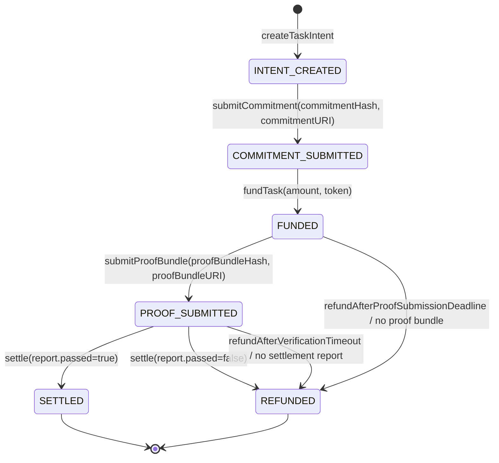

# Task State Machine

This document defines the canonical FulfillPay Phase 1 task state machine.

## Design Choice

Phase 1 uses the smallest persistent on-chain state set that can enforce
settlement safely:

```text
INTENT_CREATED
COMMITMENT_SUBMITTED
FUNDED
PROOF_SUBMITTED
SETTLED
REFUNDED
```

`EXECUTING` is a derived off-chain state observed by SDKs after funding and
before proof submission. It does not need to be stored on-chain.

`VERIFIED_PASS` and `VERIFIED_FAIL` are verifier report outcomes. A settlement
contract MAY emit events for them, but the canonical persistent final states are
`SETTLED` and `REFUNDED`. Phase 1 SDK 暂不实现这两个派生状态；Buyer Agent 可
通过 `getReport()` 主动查询 report 结果，或等待链上状态变为 `SETTLED` / `REFUNDED`。

Unfunded expiration is represented as a derived SDK status, not a settlement
state. If no escrow exists, there is nothing to refund.

## Mermaid View



## State Definitions

| State | Owner | Meaning | Required Stored Data |
|---|---|---|---|
| `INTENT_CREATED` | Contract | Buyer created a task intent and the protocol assigned `taskId` and `taskNonce`. | `taskId`, `taskNonce`, `buyer`, `seller`, `deadline`, `token`, `amount` |
| `COMMITMENT_SUBMITTED` | Contract | Seller submitted an execution commitment hash and URI. | previous fields, `commitmentHash`, `commitmentURI` |
| `FUNDED` | Contract | Buyer accepted the commitment and escrowed funds. | previous fields, `fundedAt` |
| `PROOF_SUBMITTED` | Contract | Seller submitted a proof bundle hash and URI. | previous fields, `proofBundleHash`, `proofBundleURI`, `proofSubmittedAt` |
| `SETTLED` | Contract | Verifier report passed and funds were released to Seller. | previous fields, `reportHash`, `settledAt` |
| `REFUNDED` | Contract | Escrowed funds were refunded to Buyer. | previous fields, `reportHash` if verifier-driven, `refundedAt` |

## Transition Rules

| Transition | Caller | Preconditions | Effects |
|---|---|---|---|
| `createTaskIntent` | Buyer | Seller, amount, token, and deadline are valid. | Creates `taskId`, `taskNonce`, and `INTENT_CREATED`. |
| `submitCommitment` | Seller | State is `INTENT_CREATED`; commitment hash and URI are non-empty; task is not expired. | Stores commitment data and moves to `COMMITMENT_SUBMITTED`. |
| `fundTask` | Buyer | State is `COMMITMENT_SUBMITTED`; commitment is accepted; amount and token match task. Buyer SDK 强制在锁款前校验 commitment（`validateCommitment`），确保链下承诺内容符合 Buyer 预期；合约本身不校验 commitment 语义。 | Transfers funds into escrow and moves to `FUNDED`. |
| `submitProofBundle` | Seller | State is `FUNDED`; proof hash and URI are non-empty; current time is within the contract-defined proof submission grace period; receipts still must prove execution within the task window. | Stores proof bundle data and moves to `PROOF_SUBMITTED`. |
| `settle` | Anyone or authorized relayer | State is `PROOF_SUBMITTED`; report signature is from an authorized verifier; report binds task and proof bundle. | Releases funds and moves to `SETTLED` if report passes; refunds and moves to `REFUNDED` if report fails. |
| `refundAfterProofSubmissionDeadline` | Buyer or anyone | State is `FUNDED`; the proof submission grace period has ended; no proof bundle was accepted. | Refunds escrow and moves to `REFUNDED`. |
| `refundAfterVerificationTimeout` | Buyer or anyone | State is `PROOF_SUBMITTED`; no settlement report was successfully consumed before the contract-defined verification timeout elapsed. | Refunds escrow and moves to `REFUNDED`. |

## Rejected Transitions

The contract MUST reject any transition that skips required intermediate states:

| Invalid Transition | Reason |
|---|---|
| `INTENT_CREATED -> FUNDED` | Buyer must inspect and accept a concrete commitment before funding. |
| `INTENT_CREATED -> PROOF_SUBMITTED` | Proof must be bound to an accepted and funded commitment. |
| `COMMITMENT_SUBMITTED -> PROOF_SUBMITTED` | Seller cannot execute against unfunded work. |
| `FUNDED -> SETTLED` | Settlement requires a submitted proof bundle and verifier report. |
| `SETTLED -> any` | Final state. |
| `REFUNDED -> any` | Final state. |

## Derived SDK Status

SDKs MAY expose derived statuses for user experience:

| Derived Status | Source Condition |
|---|---|
| `EXECUTING` | Contract state is `FUNDED` and no proof bundle is submitted. |
| `EXPIRED` | Contract state is `INTENT_CREATED` or `COMMITMENT_SUBMITTED`, `deadline` has passed, and no funds are escrowed. |
| `VERIFIED_PASS` | Verifier report exists with `passed=true`, before or during settlement submission. **Phase 1 暂不实现**；Buyer Agent 可通过 `getReport()` 主动查询。 |
| `VERIFIED_FAIL` | Verifier report exists with `passed=false`, before or during settlement submission. **Phase 1 暂不实现**；Buyer Agent 可通过 `getReport()` 主动查询。 |

Derived statuses MUST NOT be required for contract safety. Phase 1 SDK 仅实现 `EXECUTING` 和 `EXPIRED`；`VERIFIED_PASS` / `VERIFIED_FAIL` 留待后续迭代。

## Timing Semantics

Phase 1 distinguishes the execution deadline from the proof submission deadline:

| Time Boundary | Meaning |
|---|---|
| `deadline` | Last valid `DeliveryReceipt.observedAt` timestamp. |
| `proofSubmissionGracePeriod` | Contract-defined additional time after `deadline` during which a proof bundle MAY still be submitted. |
| `verificationTimeout` | Contract-defined maximum time after `proofSubmittedAt` before a no-report refund path opens. |

This allows execution to happen before `deadline` while still tolerating
storage upload, propagation, and transaction inclusion that land slightly later.
